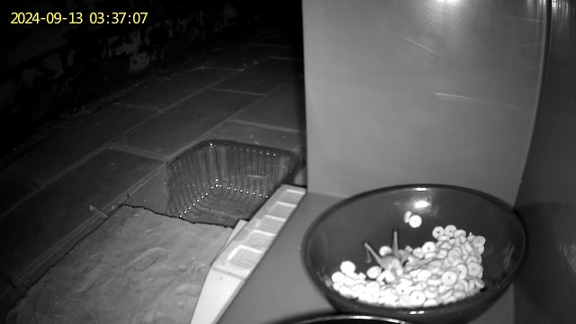
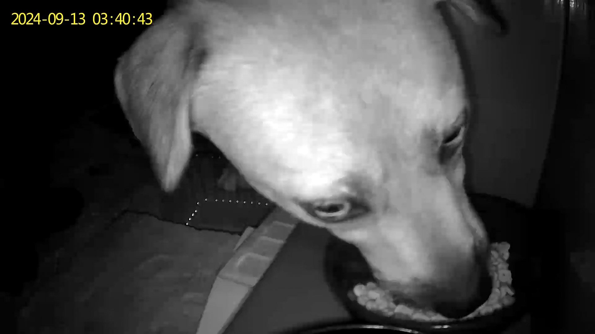
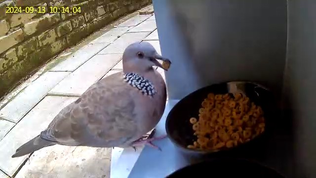
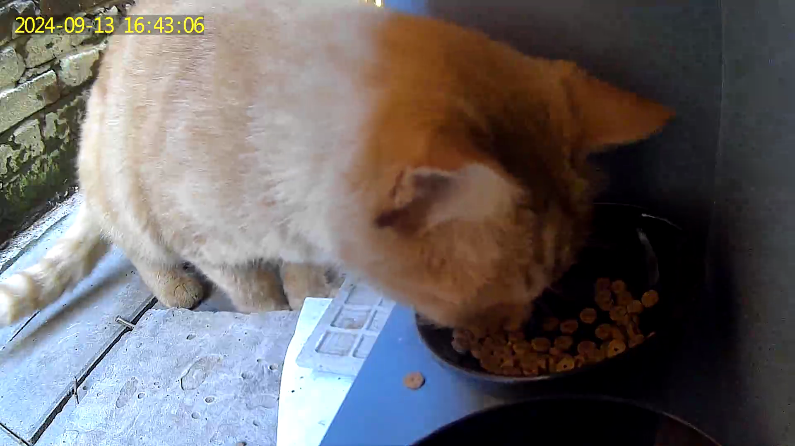
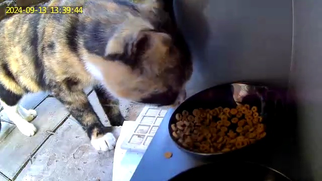
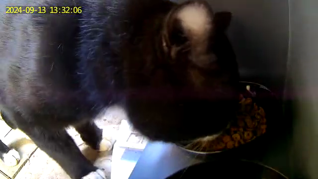
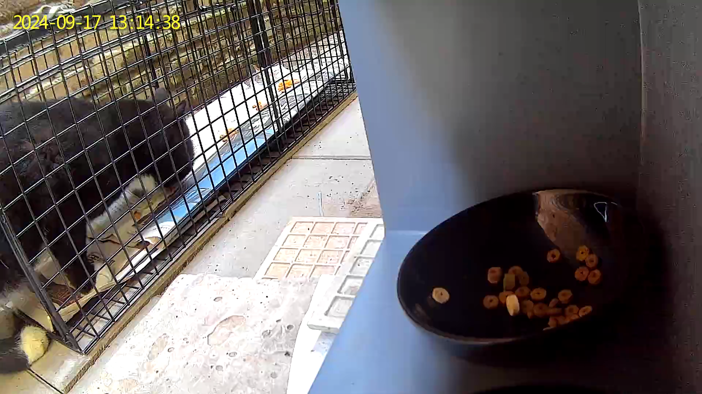
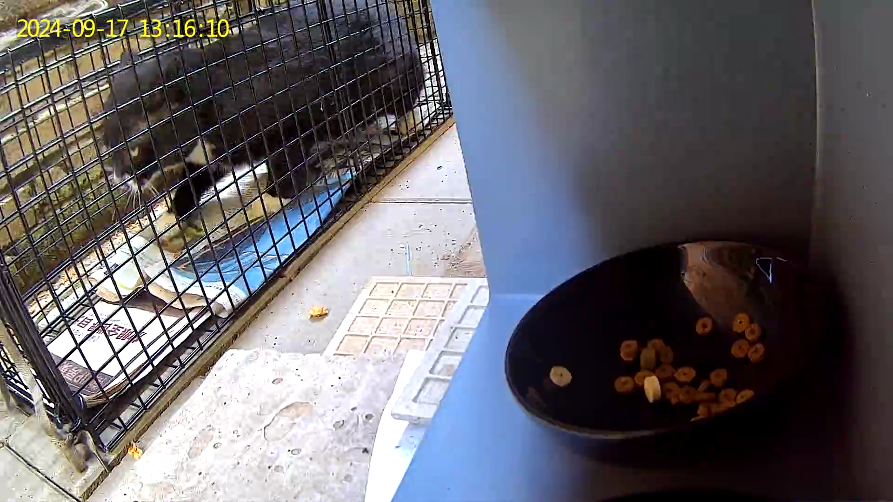
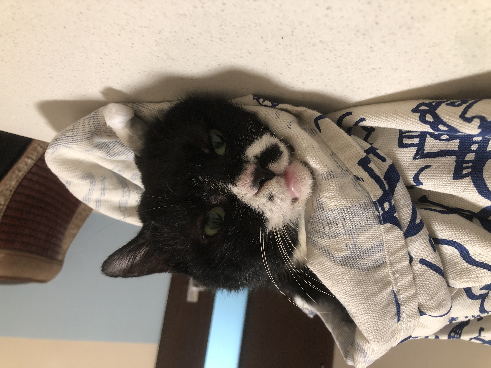
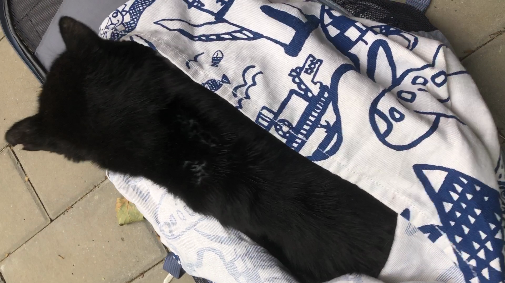

两次TNR之后，我们一边关心炸鸡和鸡米花是否来了，一边留意新的流浪猫客户。时间久了，经常在附近看到炸鸡，渐渐变得圆润了，可是饭碗每天都能吃光，真的只有炸鸡光顾吗？于是，我们给投喂点增添了一个摄像头，看看都有哪些猫来吃饭，找找新猫的时间规律，找机会再做TNR。

按照教程研究了一番功能，充满电后，安装在投喂箱内侧。

期待的、意外的事情相继发生，

😨 昆虫在猫粮上爬，就像是在一个小山坡上免费采购，好在它胃口小，一会就走了。

😱 居然会有3只流浪狗来偷吃猫粮，咣咣就吃完了，还舔了碗。第二天加粮食的时候用水冲洗了碗。

清晨，还有鸽子来一颗颗地偷吃猫粮。

意外的画面渐渐也习以为常了，**原来，这个投喂点养了好多种生物。**

当然，猫猫们也来吃饭啦，开心😄

炸鸡来吃饭啦，晚上也会来。有天早上被摄像头的警报声吓到了，过了两天才敢再次靠近。

🎊 鸡米花来吃饭了。在用摄像头之前，我们一直没见到鸡米花在草丛里休息，每天早晚添粮食的时候都要念叨鸡米花快来吃饭，以为牠去其他地方吃饭再也不来了。

这几天，我们在远程画面里没认出鸡米花的剪耳标识，误以为这是只没绝育的流浪猫，准备诱捕它。抓到黑白猫之后，无意间发现监控里的这个三花猫有剪耳，而且和鸡米花的花纹一样。

再次见到鸡米花，很开心。而且发现鸡米花饭量不错，每天都会来好几次。

😁 这就是TNR第三个目标猫，毛色黑白，太阳光下泛蓝，从圆圆的脸型初步判断是公猫，也是干饭喵，好几次是跟鸡米花一起来吃饭。

9月15日，中秋节放假第一天，我们在午饭后和傍晚两次在投喂点布控诱捕笼，等候将近6小时，步数快2w步，结果失败，没等来任何一只流浪猫来。

**这是TNR以来的首次滑铁卢状况。**

我们分析难道是炸鸡给其他流浪猫广而告之了不要来，或是猫猫们聚餐过中秋节了？

直到当晚10点多，监控消息提醒有活动，终于有猫猫来吃饭了。第二天，我们发现炸鸡在另一户人家窗外的塑料盆里吃饭。我们猜想，流浪猫在其他地方吃饱了就不会再去我们的投喂点了，即使去了也只是路过，很难诱捕成功。

9月16日正常放粮食换水，鸡米花和八卦猫在凌晨和晚上都来吃饭了。9月17日，我们准备再次尝试诱捕，早上买了新鲜的炸鸡块，中午在投喂点放置笼子，五点法放了炸鸡肉、零食包、平时吃的粮食，回家远程等待，只要有猫来吃，我们就快速下楼。

终于，下午1点多收到消息推送，打开看到八卦猫在吃碗里的粮食、喝水，闻到了笼子里炸鸡肉的味道，在笼子周围看了看，然后一步步从笼门进去了。

笼子机关触发，笼门关闭，八卦猫只是好奇看来看去，没有撞笼子。

我们看到八卦猫开始进笼子，就拿着装备跑下楼，遮盖好笼子，依照练习的转移方法，顺利把八卦猫转移到布袋里，再放进猫包。

一切收拾好，骑车带去医院。果然是很大只的公猫，估摸有10斤以上。办好手续，大概半小时就做完了手术。

等八卦猫清醒后，我们再带回小区放归。

 完美，第三只流浪猫顺利完成TNR。

可以开开心心吃火锅过中秋节啦～

