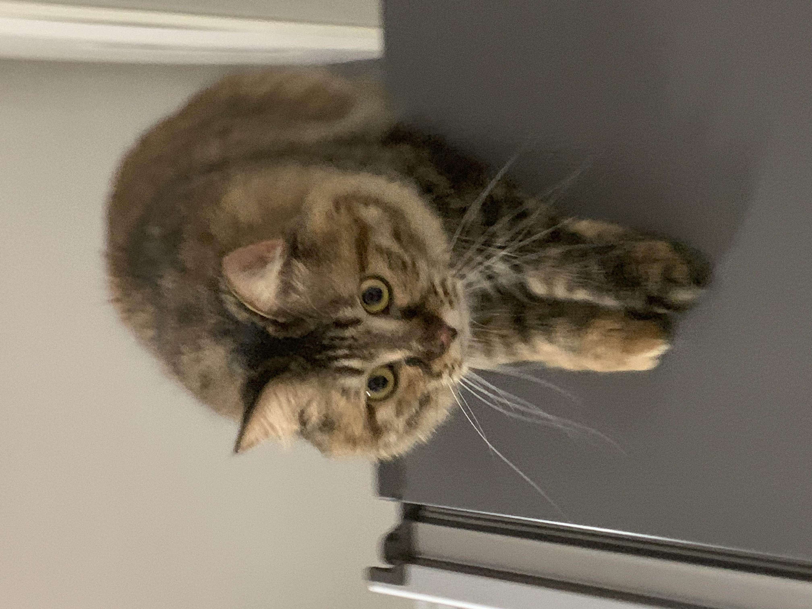
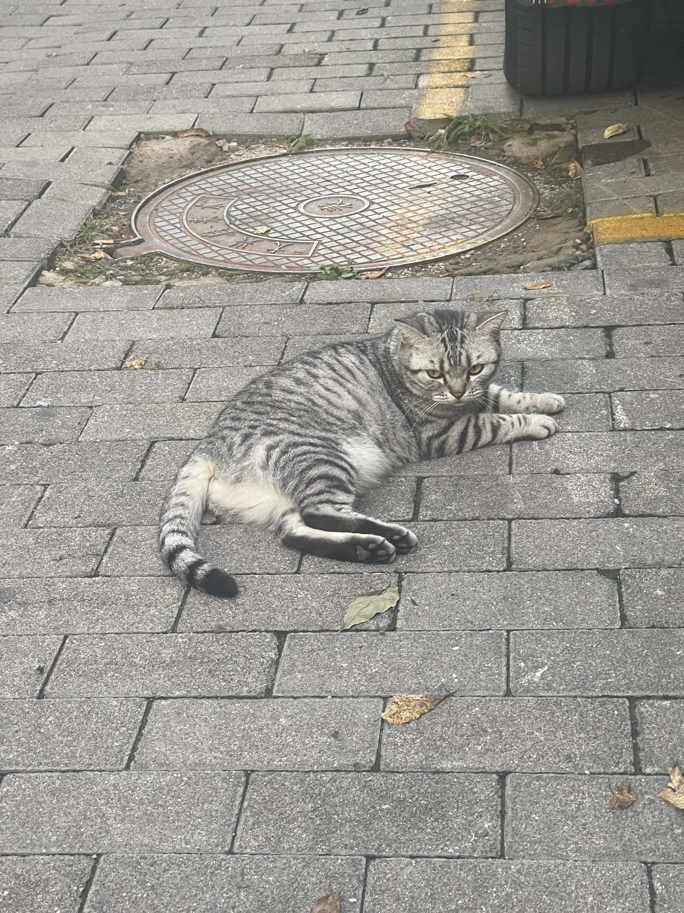
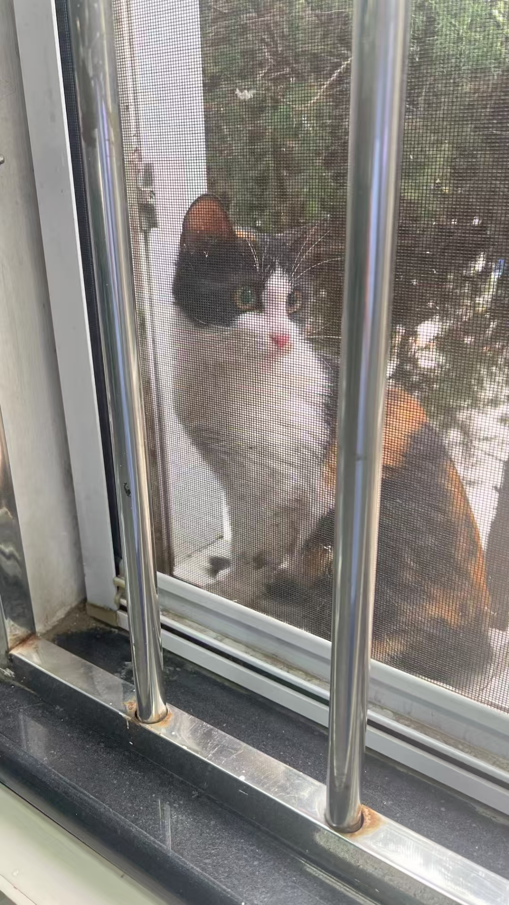

最近听同事提到遇见流浪猫的过程。

一只虎斑猫从家里走丢了，同事的孩子不顾家里小狗有多生气，将猫带回家暂住，同时在小区里找主人，2天后幸运地找到了，主人来提着猫脖子带回家了。

同事的孩子和同学夜骑时，碰到一只受伤的流浪猫，尾巴受伤，身上还有猫癣。小朋友回家拿了罐头喂猫，想有心救助但无力，需要花费不少钱，倘若带回家，狗会生气、仓鼠和鱼会害怕，回到家痛苦一场。

同事在车检厂看到一只三花流浪猫，问我要不要领养。听说是无意间进了别的车，然后趁开门时跑出来了。

前些日子，某天早上骑车在小区看到一只被车撞了的橘猫，躺在地上，吓得我们急刹车，看起来还不到1岁，身体瘦小，不知何时突然去了喵星。等到晚上回家路过，那里已经不见尸体，只有印在水泥里的残留血渍。

TNR 救助了小区里的两只流浪猫，「炸鸡」放归后躲了两周复现了，最近下楼添粮食能遇见，等我们走远了再去吃饭。「鸡米花」放归后还没再现，可能在隔壁小区。

某天，我在给家里的蹦哒猫放粮食时突然闪现一种现象：家猫吃的食物比流浪猫吃的好。

- 给蹦哒猫吃的主食是鲜肉烘焙粮，零食有水煮鲜虾、罐头、猫条、磨牙棒、冻干，还有维生素、洁牙化毛片、磷虾油。
- 给流浪猫吃的是肉粉粮食、冻肉粮食、冻干。
- 偶尔把蹦哒不爱吃的、吃剩的粮食和零食给流浪猫。

冒出这个对比，我心里顿时觉得太偏心，对待流浪猫不够好，不够公平，继而心疼流浪猫，自作主张地替流浪猫感慨“我的猫生太不容易了，命运如此千差万别。”

再延伸到自己的做法，开始产生自责心理，抱怨自己不够强大，没能给流浪猫提供同样好的食物。如此，越想越悲。

当然，我也尝试为这种想法找解释，结论式的理由没有说服自己，因为没有想出充足的分析说明。
- 每个生命是独一无二的，包括ta所要经历的事情，吃的喝的，感受到的。
- 差别化关爱是正常的，先照顾好跟自己最亲近的，才会想到关系疏远的。

后来，队友给我补充了分析过程。

- 蹦哒猫就像我们亲近的家人，自然会悉心呵护。
- 家猫在安全、衣食无忧的生活环境里待久了，自我生存能力会变弱，身体更容易出现问题。
- 流浪猫因为从小在外生活，其捕猎、自我保护和照顾的生存能力一直有。
- 救援要在自己能力范围之内，发挥自己的优势——比如整理汇总 TNR 经验知识，这样才会持久。

如此说来，千猫千面，尽心尽力便可无愧于心。
