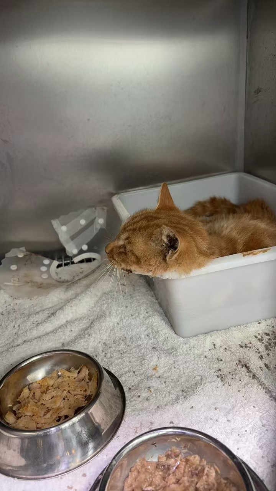
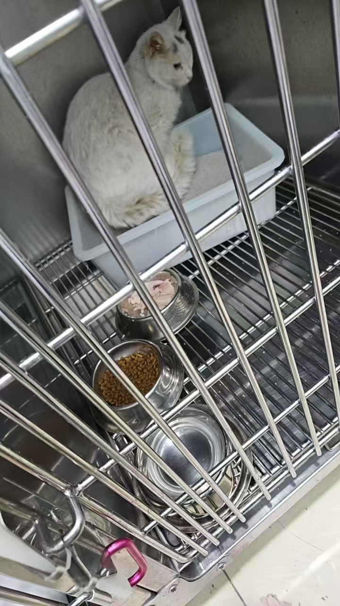
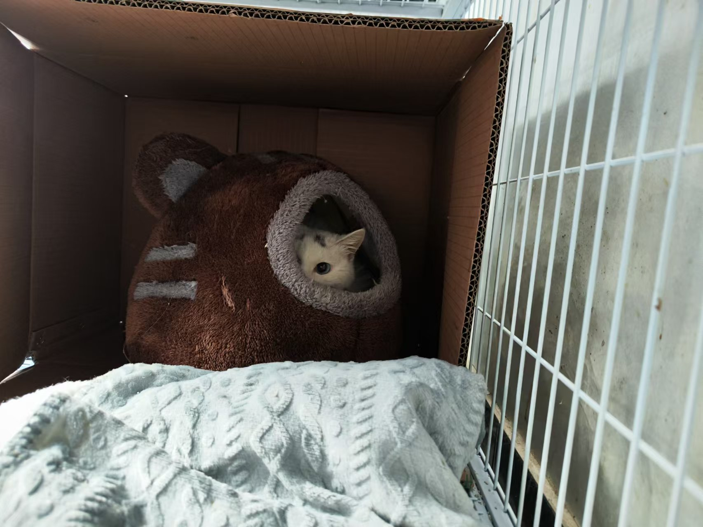
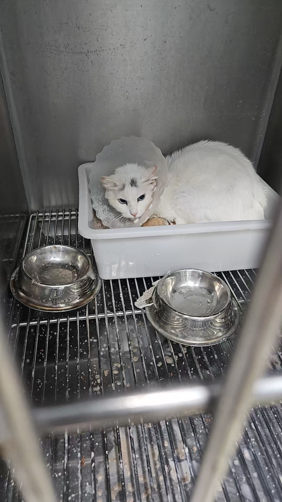

时间回到 2024 年 11 月 21 日，我们从投喂点的监控里注意到一只瘦弱、嘴角挂着东西的新流浪猫，取名「面包糠」。直到 12 月 5 日，面包糠再次出现，判断它大概率有口炎，安排时间顺利诱捕，送到北边有经验的医院治疗。2 天后，又出现一只有口炎的黑白猫，头顶有丿乀黑毛，取名「初八」，随后也顺利抓送到医院。接下来根据医生的建议，选择救治方案。此刻，花钱如流水，比起不忍心看猫咪疼痛难耐日渐消瘦，这又算得了什么？

## 面包糠治疗过程

- 12 月 6 日蹲守，成功诱捕到面包糠，送去医院做检查，指甲角质化严重，年龄估计是中老年了，确定有口炎，住院。

  

- 12 月 7 日，正常吃喝，状态正常。
- 12 月 8 日做全口拔牙手术，口腔溃烂严重，拍牙片显示齿槽骨严重吸收。同步做了绝育手术。
- 12 月 9 日，术后住院输液第一天，没有明显异常，控制饮食。
- 12 月 10 日，术后输液第二天，没有异常，开始吃罐头。
- 12 月 11 日，术后第三天输液，状态稳定，吃饭光盘了。
- 12 月 12 日，噩耗传来，去喵星了😭医生分析说面包糠长期营养不良，体质弱，麻醉引起心脏疾病。

  

这个噩耗太突然了，我们当时无法接受，可也知道这不是任何人的错误和责任。手术很成功，医生每天尽心尽责地照顾。

TNR 达人安慰说，面包糠之前大概率是在别的地方吃饭，冬季那边可能不稳定，来寻找新的食物。口炎太长时间了，体质弱，出院放归后，也不一定能挨过北方的寒冬。

随后，让医院帮忙把面包糠的遗体单炉火化。

## 初八治疗过程

- 12 月 8 日蹲守，抓捕到初八，送去医院，检查确诊有口炎，而且贫血和感染比较严重。

经过医生分析和讨论，决定保守推进治疗，怕初八承受不住大手术重创。初八先住院观察，补血、抗感染、保肝，一周后再检查贫血情况。

  

- 12 月 9 日，初八在住院笼里躲在猫砂喷后面，医生下班走了以后，初八吃完了放的罐头。

- 12 月 10 日，初八排尿，黄色很亮，开始喂 TNR 达人买的补血药。初八脾气不小，把粮食和冻干打翻，唯独吃了罐头，可能嘴巴疼不好嚼干粮。

次日，我们买了几条绒毯到医院，给初八和面包糠铺上舒服一些。

初八住院9天后，体重稍微增长了，出现稀便，开始喂益生菌调理。第二天开始继续正常吃饭，排便开始正常，白天有人在的时候也会吃饭。随后几天里，初八酷酷吃饭。

时间一天天过去，总有意外发生，跌宕起伏。

27 日，初八突然没有吃饭。医生说过两天抽血复查一下，如果不符合手术指标，就可以考虑接回去养一段时间再考虑手术。

从面包糠去世后，我们跟医生的沟通产生了偏差，互相理解有误。

医生以为我们很介意面包糠的离世，因此对初八的状态很紧张，医生也很谨慎，再加上住院会产生很多费用，担心我们有压力；而我们以为医院不想让初八继续住下去，要给其他的猫腾位子。

后来，TNR 达人跟医生沟通继续住院的事情，初八继续住院。

1 月初，临近春节放假了，我们拜托 TNR 达人给初八找了寄养的家，有暖暖的窝，尝试喂各种好吃的，看初八喜欢哪种。大概两周后体重有所增长。初八一直寄养到3月上旬。

3 月天气逐渐转暖，初八回到了医院做了检查。3 月 13 日，初八做了全口拔牙手术和绝育手术。

术后，初八输液、吃饭，一天天好起来。

一周后，3 月 23 日，初八出院继续寄养，大概 1 个半月后再复查，没有问题的话，就可以带回原小区放归啦。

## 面包糠回家

2 月底，我们在离京之前，继续抓了一只胖胖流浪猫去绝育，顺便把面包糠的骨灰带回来，在小区楼背面的大树下刨坑埋下骨灰盒。

希望面包糠来世成为一只健康快乐的猫咪，没有口炎，遇到好人家陪伴，如果没有好人，那就去到大自然里奔跑吧。

