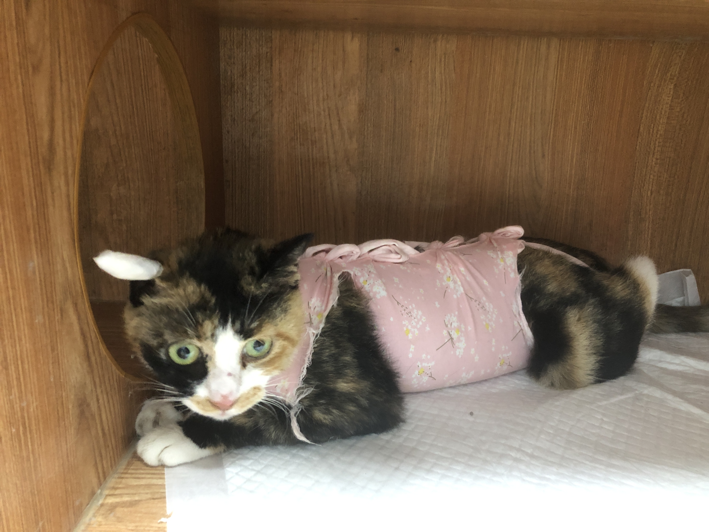
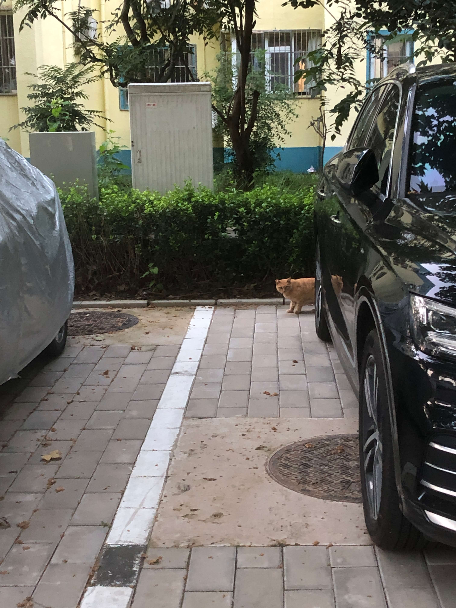
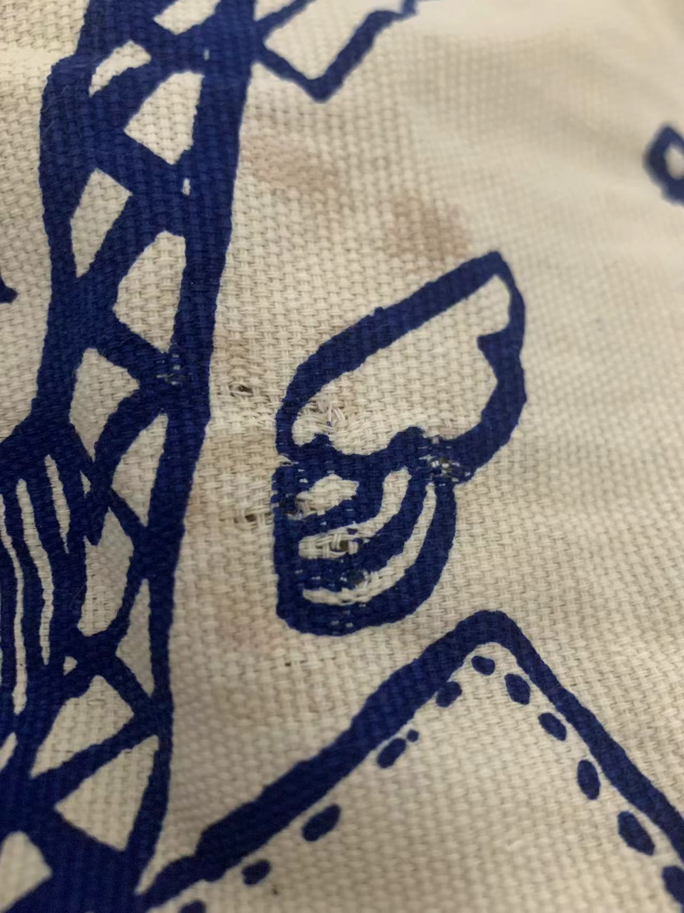
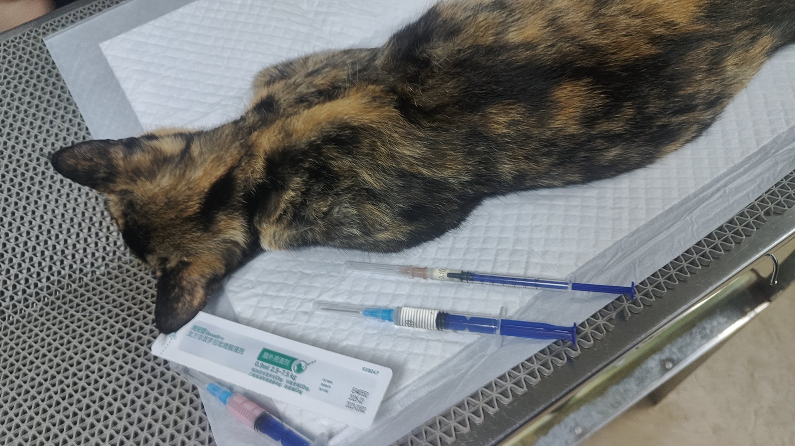
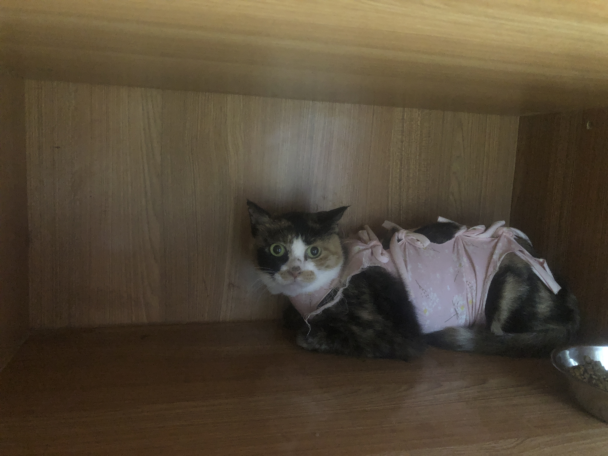
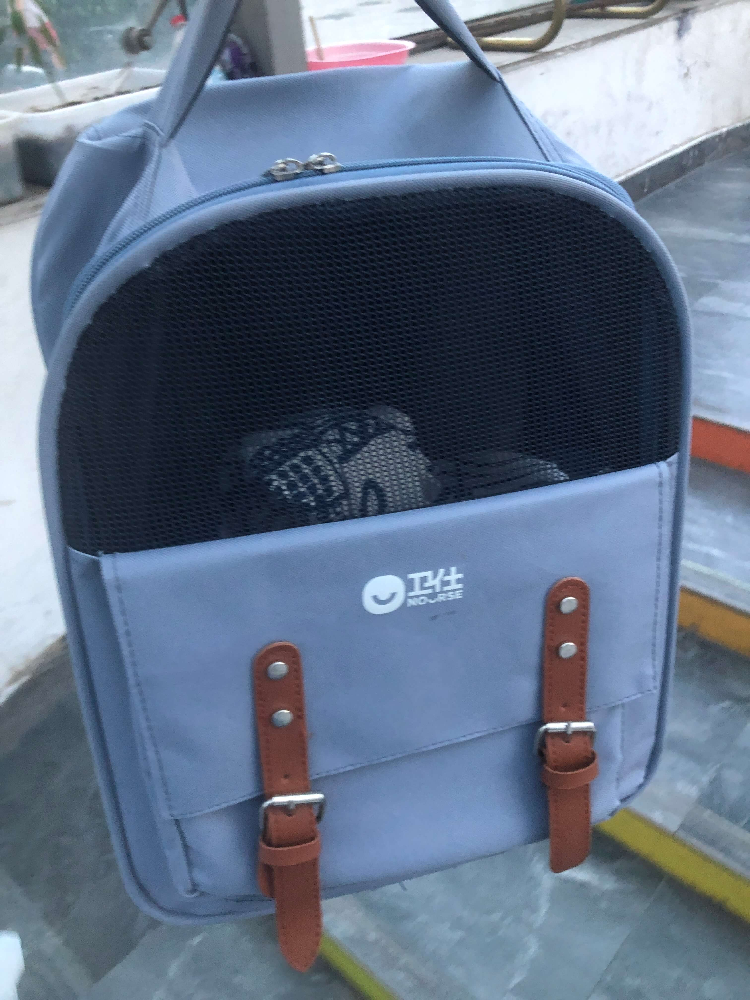
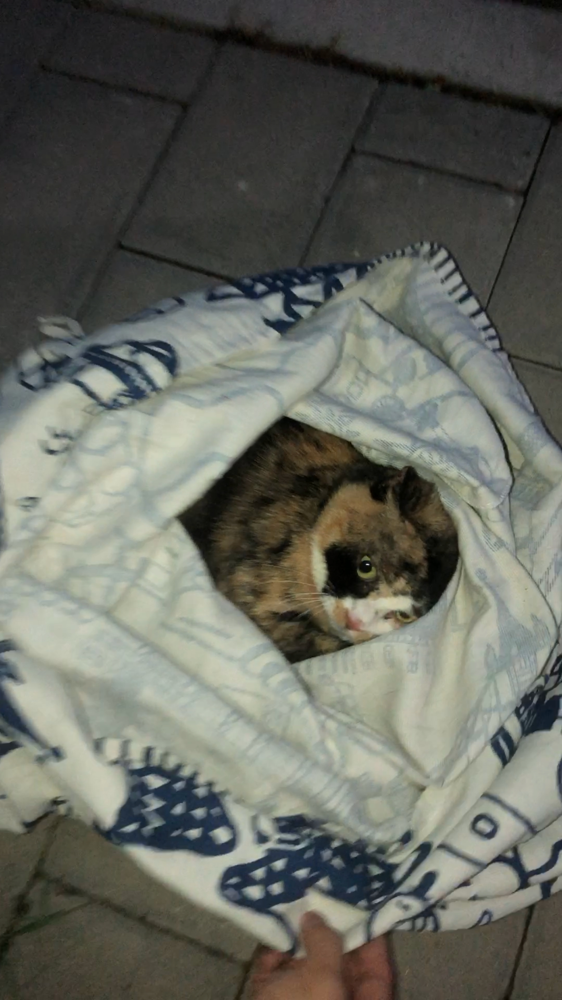

## 炸鸡回来啦

7月最有成/，在[天时地利人和凑在一块的时候，顺利给一只怀孕流浪橘猫做了TNR救助](/stray-cat-tnr)。

橘猫炸鸡顺利放归后，飞也似的奔向广阔草丛。大约2周后，某天下班回来在车棚碰到炸鸡——在这期间，早晚放粮食都会喊炸鸡来吃饭，从未见到，还以为炸鸡生气或对这里产生了害怕、讨厌。

再次见到炸鸡，它的身体比以前健硕了。忐忑的心终于落定。

## 准备第二次TNR

第一次顺利 TNR，给了我们一些信心，想要继续给怀孕三花猫做 TNR，作为新手还没有找到熟练的流程，只好做多种准备。

- 锁定了目标「客户」，多留意这只三花猫的踪迹。
- 亲自抓捕还是联系志愿者来帮忙？
- 准备抓捕需要用的物品。
	- 诱捕笼
	- 布袋：减少猫的应激反应
	- 冰水瓶：放在布袋里给猫降温
	- 诱惑食物
- 联系医院咨询
- 申请免费绝育券/绝育优惠单
- ......

咨询了蹦哒以前去的医院，申请了幸运土猫的绝育优惠单，买的布袋在途中。

8月1号晚上看到三花猫在单元楼背面的墙角舔毛休息，赶紧告诉了上次的志愿者，然后约了第二天晚上蹲守。第二日从晚上6点到8点，在附近的单元楼周围转圈看了好几遍，没有发现三花猫。

志愿者建议我们借一个诱捕笼，自己先抓捕，否则即使看见了也没有工具抓，错失机会。3日晚上，往返骑车22公里，去一个志愿者那里借了诱捕笼，看着视频教程学了一下门的机关设置，买了好吃的湿粮。

第二天是周日，打算早早下楼看看，如果碰见了三花猫就取工具抓捕，如果没有见到就去图书馆自习。

大概是前一天下雨，猫猫没有吃足够的粮食、没法来户外散步休息。第二早碰见了三花猫，赶紧取来笼子，铺上报纸、放5点好吃的，放在稍微隐蔽一点的墙根处，等三花猫闻到好吃的味道去吃。

可是，三花猫在草丛里抓小鸟失败后，去隔壁单元楼后面，趴在车底下休息，看来吃饱了想要睡觉。大概半小时后，三花猫起身走了。——诱捕宣告失败。

此时已赶不及去图书馆抢座位，我们只好收了投喂点的粮食，回家自习休息，晚上再下楼试试运气。

## 二次蹲守抓捕成功

根据上次志愿者的经验，我们下午去附近的肯德基买了几块炸鸡，准备撕一点肉诱捕流浪猫。

晚上6点多，在楼后面的草丛里，看见三花猫正趴在草丛里休息。一个人远远放哨盯着，另一个人去拿来诱捕装备。起初，我们把笼子放在楼角，不小心被聪明的三花猫看见了，三花挪步去了旁边的草丛，趴在电缆石墩上。

我们想可能是笼子不够隐蔽，就挪到了投喂点旁边靠墙放着。然后就是漫长的等待过程，还要跟飞来飞去的蚊子打架。天渐渐暗下来，很快就要进入黑夜了，到时候就更难抓捕了。

我假装很正常的走路经过，看到三花猫还在石墩上。再等了一会，远远看见它顺着墙边向吃饭方向走动。

呀！看来有希望。

可是，三花在最里面的墙边停下了，可能发现了我们在看它，也可能是在思考要不要去吃。

等了好久都不见新的动静。志愿者建议走进扔一点炸鸡肉，在猫和诱捕笼之间建立联系。

起初，我还担心三花猫看到有人靠近会跑开。没想到，走进放食物的时候，三花只是转头看着人。

再等了一会，看见三花起身去吃放在井盖上的炸鸡肉，吃完了继续走向诱捕笼。

车棚的声控灯亮了几次，但是没有听见门关上的声音，那大概是猫在挪步吃5点食物，踩到报纸发出的声音。

终于！听到门落下关上的清脆声响，我们奔跑过去看。

三花猫在笼子里，但是有些应激反应，在撞笼子。我们赶紧用毯子盖住笼子，这才稍微安静一点。接下来就是关键的倒袋转移。虽然借笼子的志愿者建议，第一次不要自己在室外倒袋，避免猫跑出来，以后就很难抓到了。但是看到三花猫不停地撞笼子，我们决定尝试倒袋。

把笼子后门抬起来，把布袋的一边压住，用布袋口套在后门上，然后用手摸索后门盲打开，让猫从笼子进入布袋。我们事先没有练习倒袋操作，开后门的时候摸不到把手，摸到了把手又不知道怎么打开，后来才发现要向上提起护栏。第二个问题又来了，猫待在笼子里不出来，我在慌乱中很用力地拍了拍笼子，把三花猫吓赶进了布袋。

接下来，我们用手把布袋口捏紧，把布袋从笼子上退下来，打结绑定布袋。听到三花猫在布袋里喘气，还用爪子挠布袋，抓出了几个小洞。

布袋绑好后，再转移到猫包里，这样便于带去医院。

等待了将近2小时后，终于诱捕到了这只三花猫。

飞快地把笼子放回家，拿了冰水瓶放在猫包里降温，发车去医院。同时联系医生，先住一晚第二天安排手术。

在去医院的路上，我们回想刚才的抓捕、倒袋过程，担心三花猫是否撞伤了、产生了很大的应激。互相安慰、鼓励之后，加速驱车去医院。

## 住院做手术

恰巧我第二天居家办公。早上收到买的猫粮后，骑车去医院办手续、看三花猫做手术。

提前预约手术的猫咪还没来，医生就先给三花猫做了绝育、引产手术，打疫苗、外驱虫。等我到医院的时候，手术已经做完了，怀了5只，大概有20多天了。

医生说，这个三花猫可凶了，脾气很大。他们早上直接从布袋里拿出来的时候，三花猫差点给医生一爪子。最后，只好隔着布袋打了麻药，再抱出来准备手术。

我事先申请到两个绝育优惠，经过早上的计算，这次用了救助同盟的免费绝育券，幸运土猫的绝育单有效期到月底，留给其他流浪猫用。

办理登记手续，这只三花猫大约有2、3岁，抓捕时吃完了投喂的炸鸡肉，因此取名叫「**鸡米花**」。

鸡米花术后麻醉苏醒了，在笼子里翻滚。这个笼子是木头的，而且很宽敞，有卧室、厕所、餐厅——豪华配置，猫粮放在笼子旁边的储物柜里。

鸡米花术后不用输液补充能量，住院10天就可以。不同的医院治疗方式不同，如果鸡米花去上次的医院，做完绝育和引产手术，大概率需要输补充液。

鸡米花术后2、3天不吃东西，我们还有点担心，医生说属于正常现象。我们咨询了志愿者之后，志愿者给鸡米花送了一些好吃的猫粮。昨天去医院看它，护士说爱吃皇家的一款粮食，白天吃的少，晚上就吃完了，早上饭盆是空的。

昨天，护士开笼子门放粮食的时候，笼子开个小口，很快速地取饭盆，又迅速把饭盆推进去。由此可见，鸡米花脾气挺大的，虽然没有「哈」人吓唬，但可能会伸爪示威。

昨天才发现，医生给鸡米花做的剪耳是三角式，不是平角的，三角形的看起来没有那么明显。这一点在住院的时候，忘记跟医生沟通统一意见。列入下次的沟通事项中。

再过几日，鸡米花就可以出院放飞自由啦！

## 鸡米花出院

8月14日，鸡米花术后第10天，医生解了手术服、拆了缝合线，一切顺利，伤口愈合不错。傍晚，我们下班回家途中去医院接鸡米花。

两个护士用纸箱和布袋，把鸡米花转移到布袋里，费了一番功夫。如果直接下手抱，很容易被抓伤。笼子设计很巧妙，相邻的两个笼子有一个小孔连通，可以把纸箱的开口对着小孔，再把鸡米花赶进纸箱，用纸板把纸箱孔挡住，然后轻拍纸箱或者拿起来让猫进到另一端的布袋里。

鸡米花学聪明了，躲在笼子角落不挪动，被多次拨动之后躲进了纸箱，继续抓紧纸箱不肯进布袋，反复拍箱、举起来口朝下，最终进了布袋。

带到小区的投喂点附近，打开布袋露出鸡米花的脑袋，她看了一眼就一溜烟地跑走了。

鸡米花出院时，比手术前圆润了，体重没有大变化。住院期间挑风味美食皇家猫粮、罐头吃，志愿者夸鸡米花「懂行」，哈哈哈。

希望鸡米花还会回来这里吃饭、喝水、休息，可以自在地抓小鸟了。

