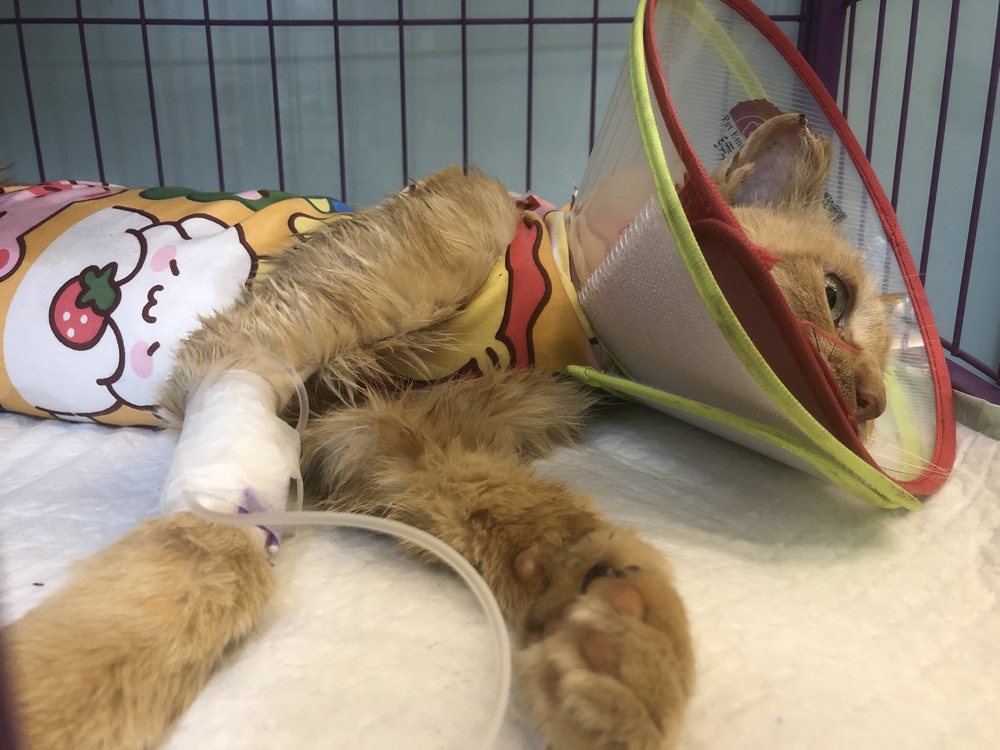

### 前情

去年搬到这个小区后，单元楼门口有一个临时的投喂点，偶尔看到有猫出没，于是用快递泡沫箱做了简易的开放式喂食箱，买了饭碗和水碗，放在楼洞口，每天早晚出门添粮换水。

小区的其他人似乎没有特别关注这些流浪猫，投喂点就这一个，偶尔看到别人放的粮食、小鱼干。

碰到的这几只流浪猫，对人有很高的警惕性，要么注视着你走开了才会去吃饭，要么就先跑远。

此时，还没有给它们做TNR的想法，并不认为是迫切需要的。

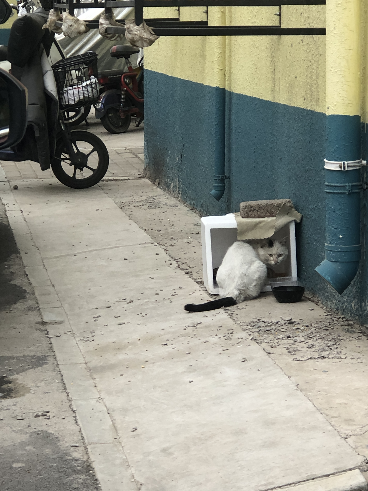

冬天，流浪猫会住在楼洞里，里面有暖气管道，暖和一些。但是，喝的水会结冰冻住，那时候还不知道有缓冻水碗。

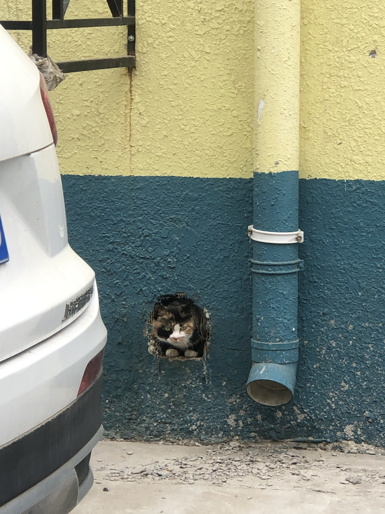

### 发现怀孕橘猫

7月9日下班回家在停车棚遇见只橘猫，牠从车棚挪步到旁边的草丛里，鼓鼓的肚子，看起来是怀孕了，我们当即决定要给牠做TNR救助。接下来的几天里，查询TNR操作、咨询救助组织。

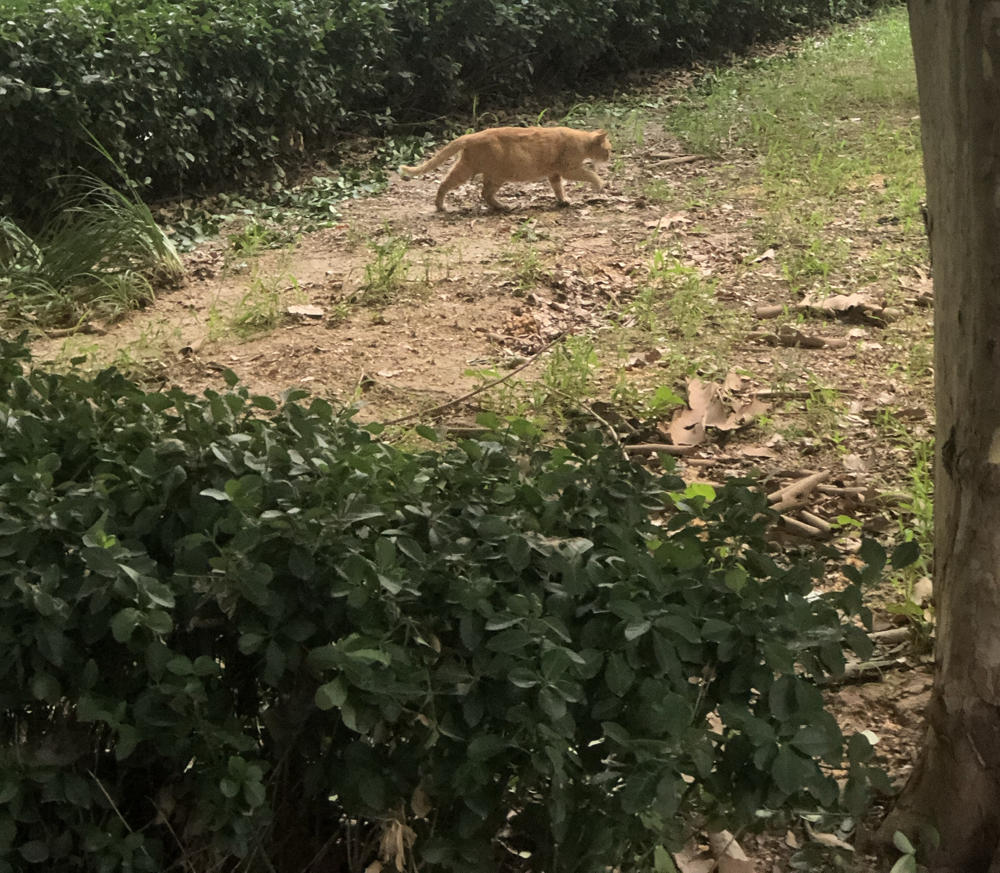

7月11日晚回家在小区溜达了一圈，其他单元楼、草丛没有投喂点。我们分析这可能是附近流浪猫出没很不固定的原因，再加上小区西门外不远处有一大片荒凉地，那里会是流浪猫狗的天然地盘。

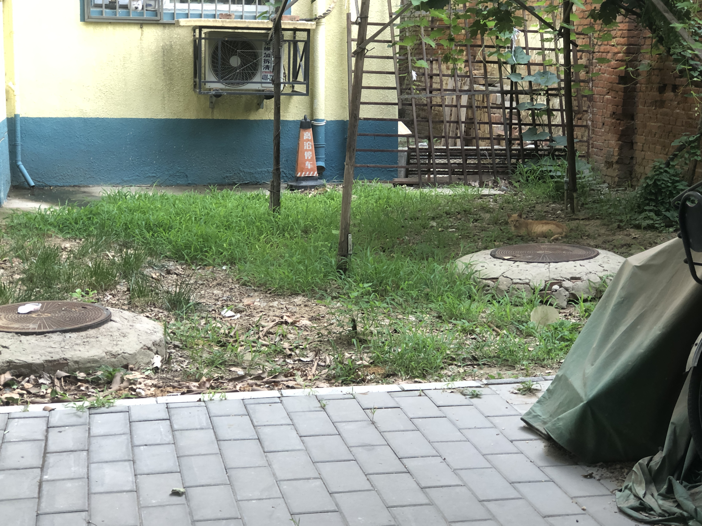

一线城市的流浪动物救助资源比较充足，可选择的方式和机构比较多。有专门的救助咨询组织、志愿团队、匹配的合作宠物医院、费用优惠服务。在TNR(A)每个环节，都有相应的救助服务平台。

### 制定TNR实施路径

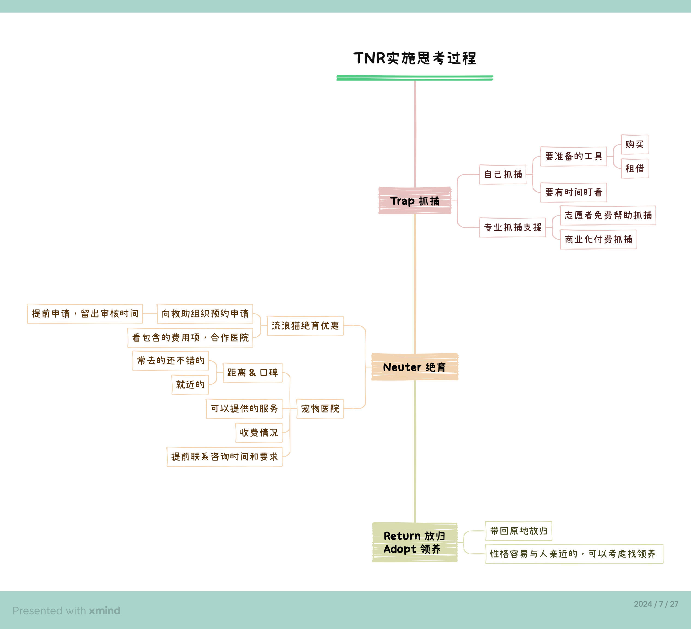

<small>（这是完成之后的简单复盘）</small>

开始找资源咨询专业服务。
- 专门的抓捕小队需要收费，路费挺贵的——起步价就100，还要额外2元/公里，抓捕费一只100元——还能接受。考虑到流浪猫出没时间没有规律，这个就pass掉了。
- 【它世界志愿者团队】是由全国各城市爱心志愿者组成的团队。他们可以提供免费抓捕救援协助，志愿者接单来现场协助抓捕，或是租借诱捕笼、布袋等工具。——咨询登记后，一开始没有志愿者接单，可以借工具。我们还在为新手抓捕紧张的时候，很幸运，有志愿者可以过来帮忙。
- 我们也在同步查询了【幸运土猫】【北京领养日】做绝育的优惠支援，最后在【北京领养日】申请了绝育单。为了不耽误抓捕后马上送医院做手术，我们提前申请留出充裕时间。很快，第二天下午就开出了绝育预约单，并联系咨询了医生。

在整个过程中，我们从查阅的[资料](https://mp.weixin.qq.com/mp/appmsgalbum?__biz=MzU4Mjk5ODkxOA==&action=getalbum&album_id=3093604989357015047&scene=173&subscene=&sessionid=svr_170f0fded0a&enterid=1722073065&from_msgid=2247498802&from_itemidx=1&count=3&nolastread=1#wechat_redirect)、志愿者、TNR交流群里学到了很多，很钦佩有志愿者做了十多年流浪猫抓捕服务，而且每天花很多时间在TNR交流群里为新手解答问题。

### 运气很好的抓捕

7月13日抓捕当天，根据猫此前出现的时间，我们跟志愿者约的下午7点见面。早早下楼先去找这只橘猫，两次都没看见，反而遇到另一只很警惕的玳瑁猫。想着，万一怀孕橘猫没出现，到时候就先抓捕这只玳瑁吧。

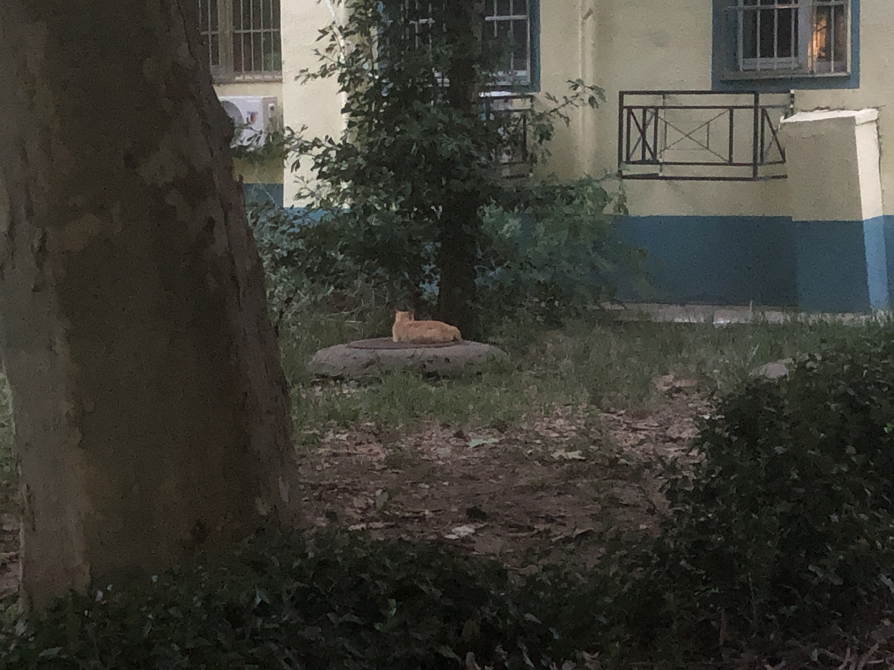

真不巧，志愿者抓前一只猫耽搁了点时间，晚了一会到我们这里。然而，很幸运地看到了怀孕橘猫，正在井盖上休息。

也许这就是缘分吧。

听从志愿者的安排，我们在稍远处等待。志愿者用食物跟橘猫对话，把诱捕笼放在平整的地方，等待橘猫被食物香味引导进诱捕笼。

开始不太顺利，志愿者分析橘猫可能已经吃饱了，或者是对这个食物味道不感兴趣，所以没有要挪步靠近笼子的意思。后来，志愿者换了笼里的食物，放了一点点炸鸡，橘猫开始靠近笼子，在外面徘徊思考——要不要吃，怎么能吃到呢，会不会有陷阱？

40多分钟后，终于，橘猫进笼子吃食物，踩到机关，前门关上了。志愿者把布袋套在笼子后门，橘猫进了布袋。

抓捕成功！✌️

接下来，我们把橘猫放在航空箱里，骑着小电驴去预约好的医院，做登记，住院。

橘猫爱吃炸鸡，所以给起名「炸鸡」。

### 绝育

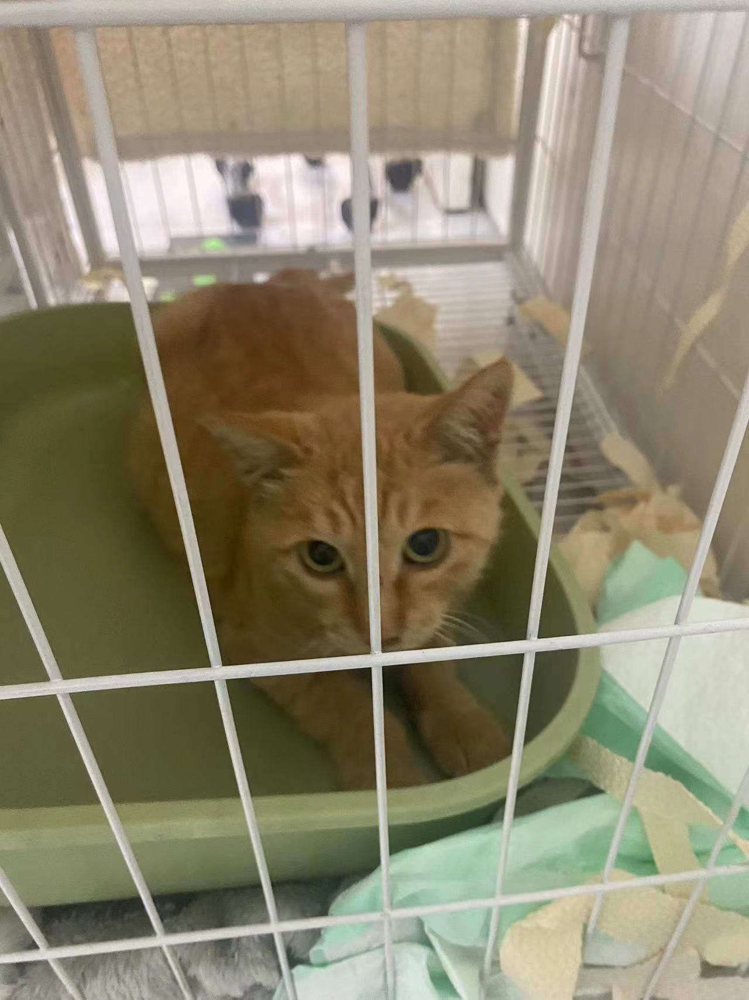

第二天中午，医生给炸鸡做引产和绝育手术，剪耳标。我们带了一些猫砂、罐头、粮食过去，等待手术顺利，开始住院输液慢慢恢复。

医生说，炸鸡全身有很多跳蚤，手术前喷洗了一番。

看着刚做完手术的炸鸡，可心疼了。

庆幸以后就不会受苦了，可以有更长的时间自由自在。

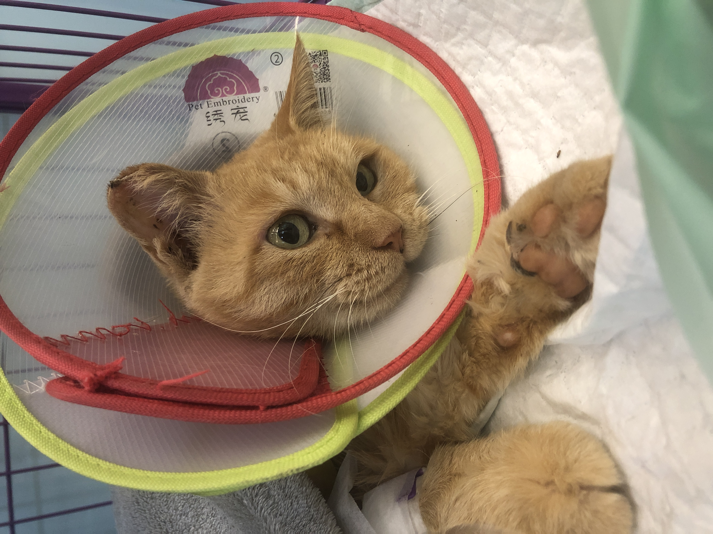

就这样，医生每天给我们发炸鸡的状态。

炸鸡在医院始终是胆小、警觉的状态，尤其白天有人在的时候，尽量缩在笼子最里面一动不动。晚上医生下班没人了，炸鸡才会吃饭、喝水、上厕所。

我们原本想给炸鸡找领养，查阅了幸运土猫、北京领养日的一些专业资料后，决定出院后放归自然，这样对炸鸡来说是更合适的。

7天住院，炸鸡一天天好起来，吃饭、排便都正常了。跟医生约了疫苗，然后再住院观察了两天，出院。

### 放归自然

7天之后，炸鸡顺利出院。我们去医院接回小区，在牠熟悉的地方打开布袋放归。

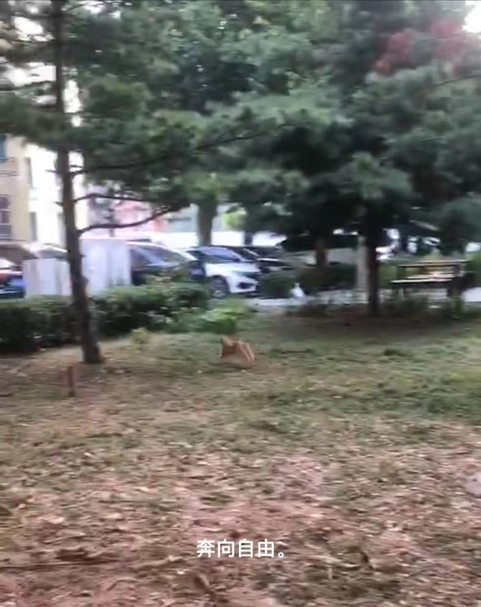

炸鸡从布袋里嗖的一下窜出来，奔跑向草丛里，身影是那么矫健、轻松。

借用文章里的一段话表达当时的心情：

> 每次看到猫猫手术后，在手术床上拍的照片，我都很欣慰，因为它的新生开始了。从今往后，它就是一只饱食终日无所事事的猫咪，它是只为自己而活的猫，不再陷入因为激素驱使的发情、干仗、生崽、死亡，再生崽的死循环中。

### 投喂点改进

我们查阅了投喂点安置的[攻略文章](https://mp.weixin.qq.com/s/hGwrpb4asIuj69-1b7az9w)。根据志愿者的建议，买了耐用的箱子，找来砖块垫高放置，周围喷上氟虫胺减少蚊虫，把投喂点从显眼的楼门口挪到楼后面的车棚、草丛旁边。

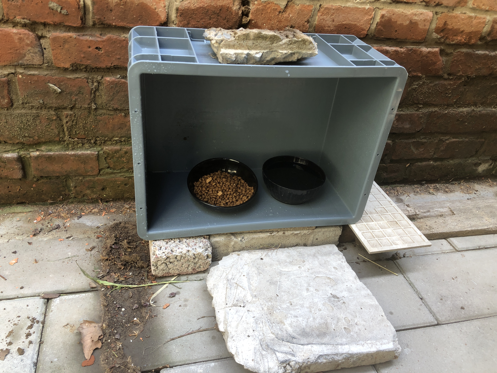

希望炸鸡可以无忧地享受喵生。
