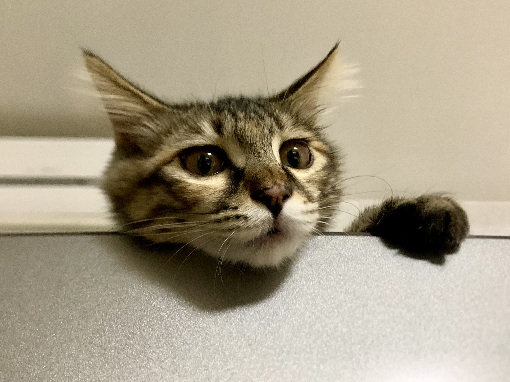
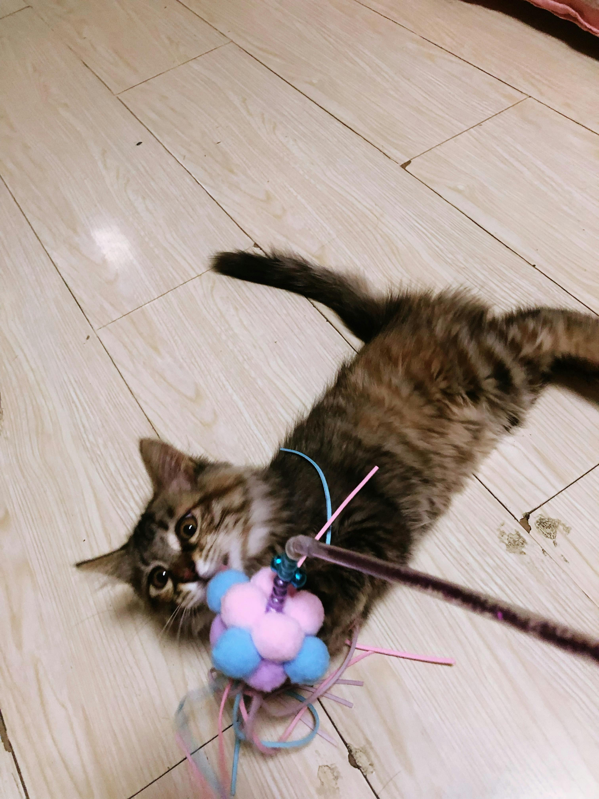
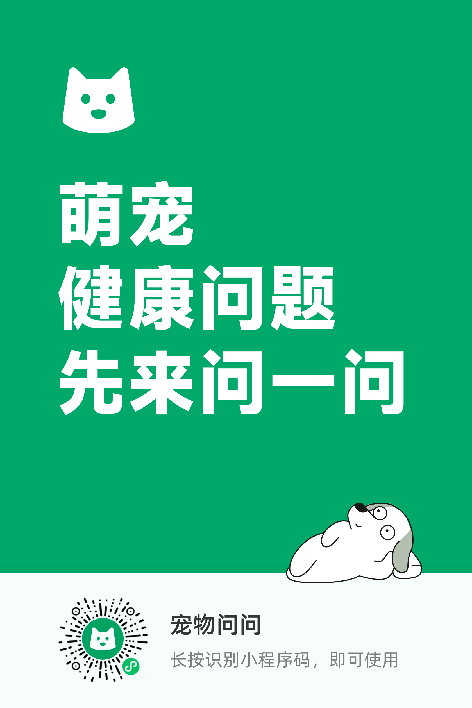

许久没有更新 blog，忙忙碌碌中缺少思考，那就先分享点生活有趣的变化。

5 月 29 日，我们从郊区的一户人家领养了一只小喵🐱，取名叫「蹦跶」。

> 此处是猫咪说话：
>
> ；胖 3wlkrrrrghewwwwwwwwwwwwwwwY

「蹦跶」出生于今年 3 月 3 日（爱耳日，哈哈），领养时快 3 月龄了，小母猫，牠妈妈是只橘猫，但牠的毛比较长，而且橘色很少很少，当天带到医院做检查时才知道有缅因猫的基因，脸型、背毛很像缅因的样子，腿上有相间的橘色。

公共交通工具不允许携带宠物上车，所以只好打车回家，大概 1.5 小时车程，「蹦跶」在原主人家里看起来比较胆小、温和，也不喵喵叫。在带回家的猫包里很用力地喵喵叫，可能是因为车太颠簸，有点晕车、害怕、紧张，想逃离猫包，用脑袋顶两侧的开口，用爪子挠网格。

我们一边学猫叫回应牠，一边用手在猫包外安抚，或者用背包挡住网格，不让牠看到外面；司机大概受不了「蹦跶」喵喵叫，打开了音乐电台，有一阵「蹦跶」安静了，我以为是音乐声让牠平静一些，后来发现并不是。

后来地搬家中，同样用猫包带蹦哒坐车，路途不远还是喵喵叫。

近期带去医院打第二针疫苗，蹦哒在车上喵喵叫时，用手在外面挠挠牠的头和脸，似乎能缓解紧张感。

在接猫之前，网上查阅养猫经验的资料、书籍，泛读了解、日常疑问查询。准备了猫包、猫砂、猫砂盆、猫粮、奶粉、逗猫棒、猫抓板。

*   [《新手养猫：从行为解读到温暖相伴》](https://book.douban.com/subject/35273207/)
    
*   [《新手养猫指导手册：从读懂猫咪心理到温暖相伴一生》](https://book.douban.com/subject/35921159/)
    
*   [《**猫咪家庭医学大百科：全新修订版》**](https://book.douban.com/subject/35463390/)
    
*   微信公众号：猫研所，定期有猫咪行为学免费在线课
    
*   小程序：宠物问问

    

当天带蹦跶去医院做了基本体检、滴药驱虫，从此刻开始作「铲屎官」。

蹦哒到新环境适应还比较快，大概 3 个小时吧。开始躲在沙发下面，在玩具的引导下慢慢出来探索环境。熟悉之后，蹦哒就开始在晚上跑酷，睡到床角、脚旁边，逐渐信任我们。信任感再次升级，就敢跳上椅子、书桌、饭桌，人从冰箱取东西时跳进来。当然，对牠还没去过的环境始终保存好奇，比如衣柜、干货箱、厨房、卫生间。

除了卫生间，其他地方都允许蹦哒在有人的时候进去探索。进厨房，蹦哒一开始跳不上灶台，只能在脚边喵喵叫。后来有一天，从远处助跑跳上了灶台，但也不能由牠捣乱，洗菜池始终很好奇，就是不允许踩下去，烫的厨具不允许碰。满足一会牠的好奇心之后，就抱出厨房闭门禁止入内。

说起厨具，有一次做晚饭从电饭锅盛出米饭，把内胆拿出来接水洗，没有关锅盖。短短时间里，蹦哒就直接跳到电饭锅上，脚踩到底部导热的地方，牠反应快嗖地一下跳出来。当时吓到铲屎官了，赶紧检查牠的脚和肉垫，抚摸安慰牠，幸好没有受伤。从此以后，铲屎官做饭时尽量不让蹦哒进厨房，尤其在烧饭的时候坚决不能进，电厨具用完关闭。

离开喝水的功夫，蹦哒又来说话了😄：

> yu'】888888888888kl-lll；；lllllllllllllllll
>
>。。。。。。。。。。。。。。。。。。。。。。。。。。。。。。。。。。。。。。。。。。。。。。。//////////////////////////////////////////////////////////////////////////////////////////////////////////////////////////////////////
>
> /////////////////// 新沙岛 h j j j j j j j j j j j j j j j j j 2333 d s we 444444uuu j e 499999999uiiiiiiii//

蹦哒到新环境一周后的周末突然变得没有精神，吃饭、上厕所次数变少，大部分时间都在蜷缩着睡觉。铲屎官摸肚子也没有感到有异物，蹦哒也没有疼痛叫。称体重的结果是 1.7kg——2.1kg——1.7kg，体重变化异常，铲屎官觉得蹦哒可能生病了，网上搜索一些经验之说也越发担心，晚上带去医院检查，量体温接近 40 °C 是发烧了，血检、粪检都正常，没有猫瘟的迹象，但具体原因不清楚。医生打了退烧针，建议先给喂吃好消化的流食罐头，回家观察两天，如果没有好转再来做进一步检查。

幸运的是，2、3 天后蹦哒恢复原来的虎样了，每天量体温也是正常的。后来，铲屎官判断可能是没有采用「7 天换粮法」，直接给蹦哒吃新干粮不适应。于是，铲屎官网购了蹦哒以前吃的一种干粮（杂牌，这也是当时直接 100% 换粮的原因之一），和现在的猫粮混合着给蹦哒吃。

蹦哒以前吃的猫粮气味很有诱惑力，而且成分表排在前面的主成分有谷物类。但是，为了让蹦哒适应换粮，只能这样。

关于猫咪的体温，书上是这样写的：

一般而言，猫咪的体温在 39.5 °C 以下，如果量体温时猫咪挣扎或季度紧张，就可能会超过 40 °C ；临床上常遇到兽医师将体温 39 °C 以上判定为发烧，这对狗或许还说得通，对猫而言就有点夸大了。

蹦哒平时吃饭是自由进食、喝水。每天早上铲屎官换新的凉白开，洗干净猫粮碗，在猫粮上面撒一点猫草。铲屎官晚上做饭时煮鸡胸肉撕小条给蹦哒。

在 6 月底搬家，看了一个真正的一室一厅房子，客厅也很大，适合给蹦哒玩耍、 铲屎官嘿哈锻炼。

人和猫搬到新家都很开心。慢慢地给蹦哒丰富娱乐设备和食物。买了大盒冻干，偶尔给奖励零食吃。经过一番查经验资料和选择对比，买了个 5 层、高 1.45 米的猫爬架，有猫窝、太空舱、瞭望台、猫抓柱。厂家发货着急了，漏了小楼梯木板、猫窝顶板缺大螺丝孔，补发的已经在路上，其他部分已经安装放好。

4 个月的蹦哒对新玩具还是有些怕，不敢主动去猫爬架的透明太空舱里，可能是怕掉下来。渐渐地，抱蹦哒放进去，拍拍屁股，蹦哒就会安稳趴在太空舱里。

蹦哒现在也习惯跑去阳台、窗台看风景、休息。铲屎官还没有做封窗安全措施，所以每天出门时不敢打开窗户，怕蹦哒好奇打开窗纱。很快，会安装好网格窗纱，这样可以比较安心地开窗通风。

另外，铲屎官也比较好奇蹦跶独自在家里会做些什么。于是，采购了监控摄像机，在搬砖休息时可以远程看蹦哒，还可以语音打招呼。

铲屎官在家吃饭时间看电视播放《[spy in the wild](https://movie.douban.com/subject/34951711/)》（《荒野间谍》），蹦哒偶尔会专注地看。

铲屎官每天下班回家进门后，蹦哒就会跟着进进出出、喵喵叫。我们猜测有几个原因：

*   饿了想吃饭（猫碗里已经空了）。
    
*   想铲屎官陪牠玩耍。
    
*   想铲屎官给牠挠挠痒。
    

短短一个月，蹦哒的体重变化动态是：1.7kg——2.1kg——1.7kg——2.1kg——2.2kg——2.4kg——2.5kg。体形也变长、变大了。铲屎官每天陪蹦哒玩半小时，能让蹦哒开开心心，蹦蹦跳跳不胖肚，睡前放电也有助（少）睡（跑）眠（酷）。

现在唯一不解的是，蹦哒在半夜或者清晨咬铲屎官的脚，不知道是无聊玩耍，还是有什么需求。

成为铲屎官，很幸运能有蹦哒陪伴、带来欢乐。养护这个小生命，有人说虽然和生养孩子不同，可也要认真对待，付出财与物、精神陪伴，有始有终。有时候可能不只是铲屎官在陪猫咪玩耍，这个过程也能让铲屎官感受到生活的丰富性，得到一些治愈。

希望蹦哒和铲屎官都能健健康康、快快乐乐地互相陪伴生活。

（照片有空了补充）
