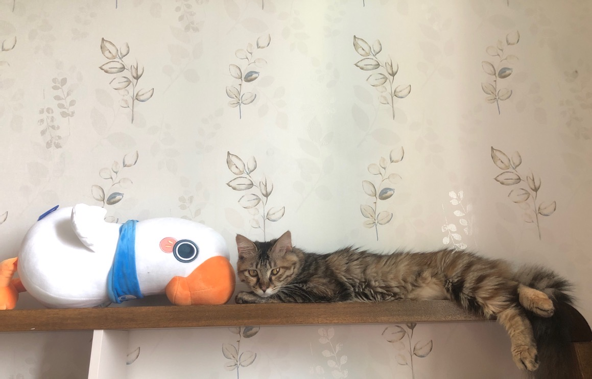

[蹦哒过完 6 月龄生日](https://rosea.hashnode.dev/bengda-happy-birthday-day)，一周后去医院做绝育手术，一切顺利，术后一周恢复不错，现在可以继续活蹦乱跳了。
### 做手术

手术当天，凌晨 4 点多开始断食，6 点多开始断水。早上踩自行车 10 点到达医院。

术前抽血检查一切指标正常，B 超检查也正常，护士抱去手术室。

铲屎官在大厅等待半小时，蹦哒出手术室了，麻药还没消散，睁着圆溜溜的大眼睛，侧躺在尿布上，穿着花花的绝育服，变成了瘦小猫。

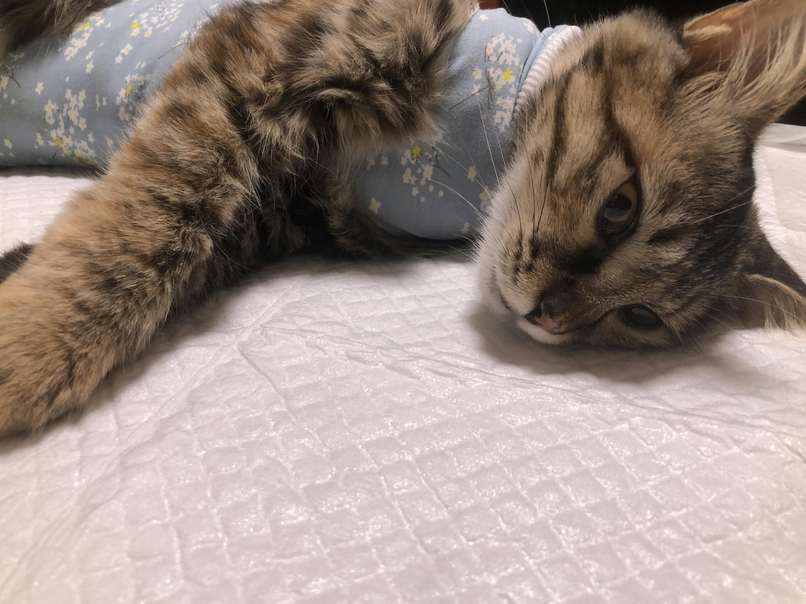

麻醉药一点点消失，蹦哒爪子慢慢有点活动反应。再过了一会，蹦哒尝试四肢撑着趴在猫包里，头朝里自闭 / 害怕。

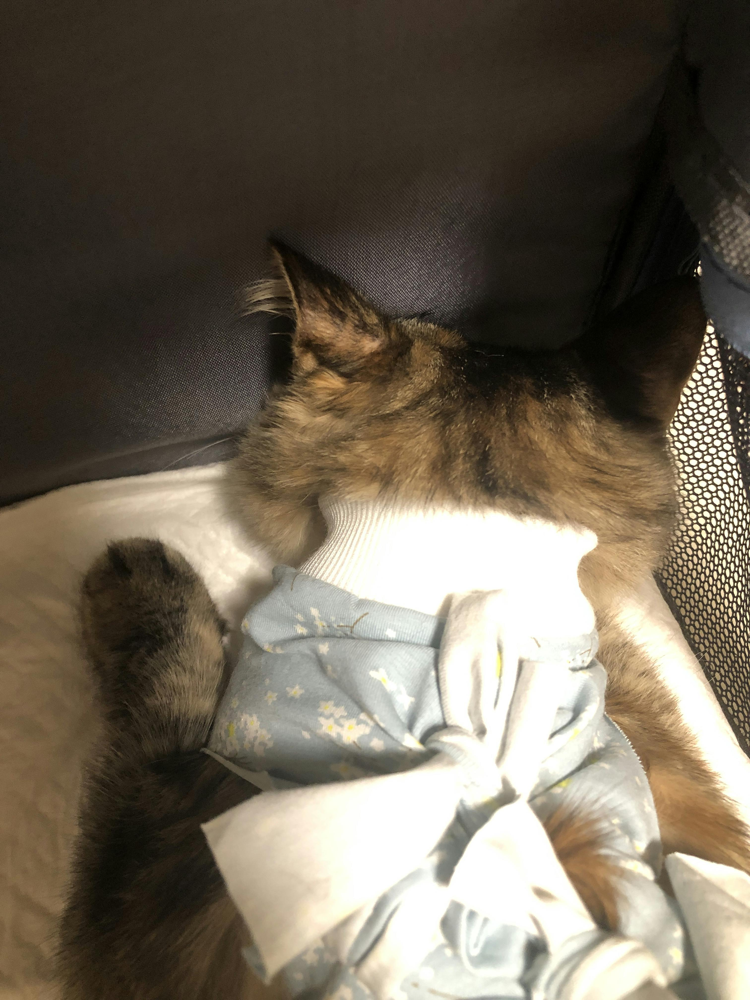

再半小时后，蹦哒意识清楚，医生看过没有问题，开了止痛消炎药片、叮嘱注意事项，准备回家。

把蹦哒放在猫包里，头和屁股顶着两侧的透气网。院长进来帮忙把猫包放倒，宽度空间更大一些，蹦哒侧躺、趴在里面，再用尿布盖着，这样就稍微舒服一些。铲屎官托抱着蹦哒打车回家。

### 术后照顾

虽说照顾猫咪就像照看小孩一样，铲屎官感觉照顾猫咪更累。

小孩子生病不舒服会哭、会叫，大人能马上去看，磕碰、摔倒而哭，大人也能及时发现。但是，猫咪很能忍疼痛，而且也不常喵喵叫来表达，即使在做了手术的情况下，也想要跳高，这就需要铲屎官时刻在身边守护。

术后需要照顾一周，主要在于：

*   尽量不让蹦哒跳高，避免伤口挣扎裂开。
    
*   喂消炎、止痛药。
    

回到家后，蹦哒从猫包里出来，躺在尿布上，一会站起来走动，但是很害怕、紧张的样子。贴着墙边在客厅走；铲屎官靠近的时候，总是后退躲避倒着走，大概是手术产生的应激性的害怕；不习惯绝育服的束缚，走路甩脚。

不走动的时候，就趴着休息。

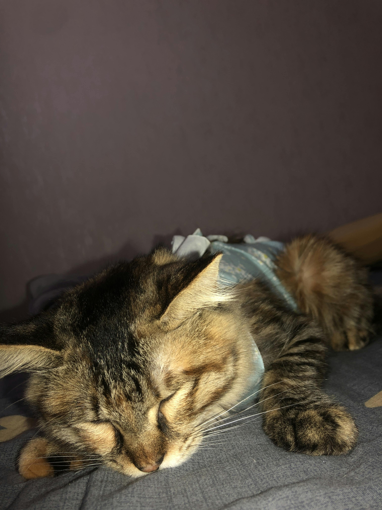

原本，铲屎官想彻底避免蹦哒跳来跳去，跟在蹦哒后面走，发现想跳的征兆，就立马抱起来放在高处。后来觉得很难做到，而且担心抱的时候弄疼伤口。于是，铲屎官就用凳子、椅子给蹦哒搭桥，让蹦哒跳每次跳的高度比较低。

术后当晚，两个铲屎官轮流值班照看蹦哒。蹦哒一整天没有吃东西喝水了，伤口恢复需要营养和能量。蹦哒还没有主动喝水、进食的意思。铲屎官只好喂蹦哒喝水，用手指蘸水浸湿嘴唇，蹦哒就会舔一舔。

铲屎官工作、学习，蹦哒在旁边休息。第二天，铲屎官哈欠连天，靠咖啡因续命度过。

第一天，铲屎官看蹦哒躲闪、没精神的样子，担心蹦哒生气再也不搭理了。

也许，蹦哒感受到了铲屎官悉心照顾、陪伴的爱，也确认了所在的环境是常驻家。第二天早上，就看到蹦哒头靠着铲屎官的腿呼呼睡觉。

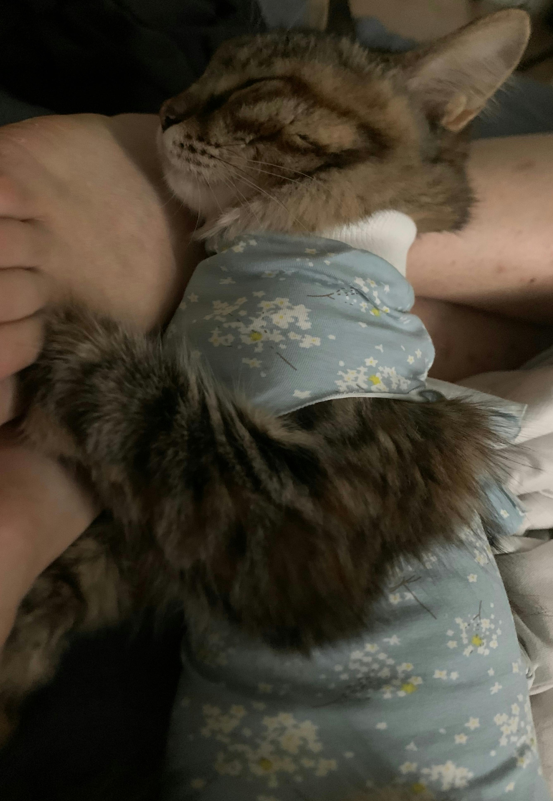

第二天，蹦哒开始主动吃饭，走路仍然不习惯绝育服，好在不害怕环境了，正常向前走路，还想要跳到高处，地面——沙发——高台，上猫爬架进太空舱。

铲屎官把蹦哒抱到猫爬架上，蹦哒自己进太空舱呼呼睡觉。

第二晚开始，铲屎官再没有轮班看守，而是把猫砂盆、水碗、粮食放在卧室，让蹦哒在卧室床角、椅子、琴键上睡觉，想要上厕所、喝水、进食就比较方便。

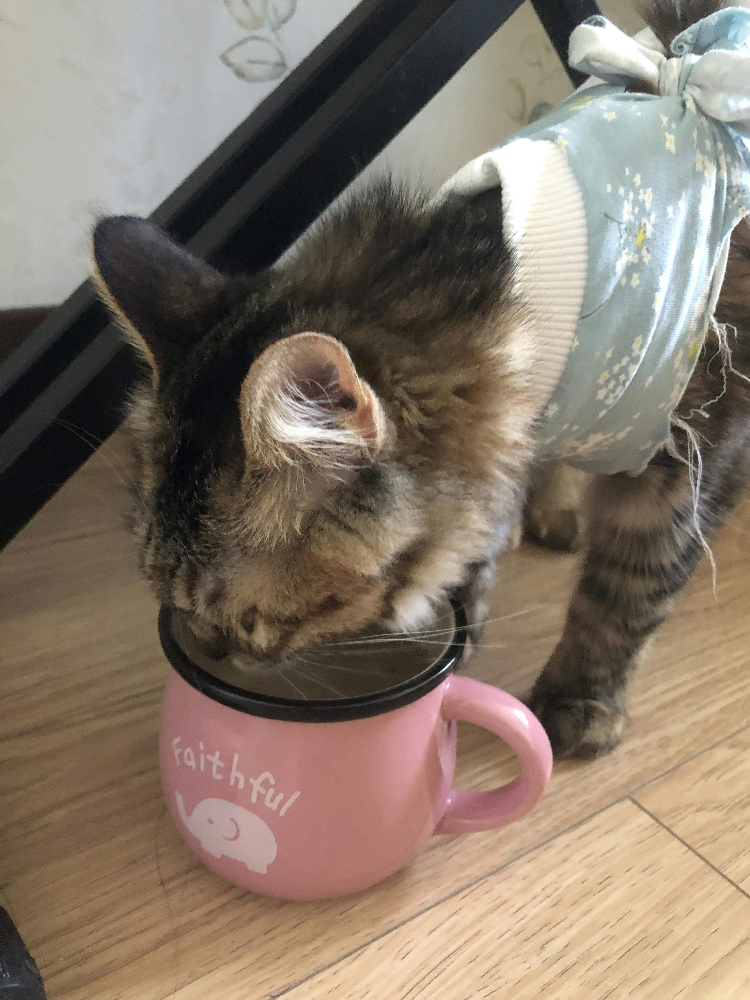

随后的几天里，蹦哒愿意吃粮食、喝水，也开始想尽办法舔毛，顺便咬绝育服的线头。铲屎官以为药片是苦味的，需要按住喂药，没想到放在主食包或者干粮里，蹦哒就会主动吃掉，没有抗拒的意思。

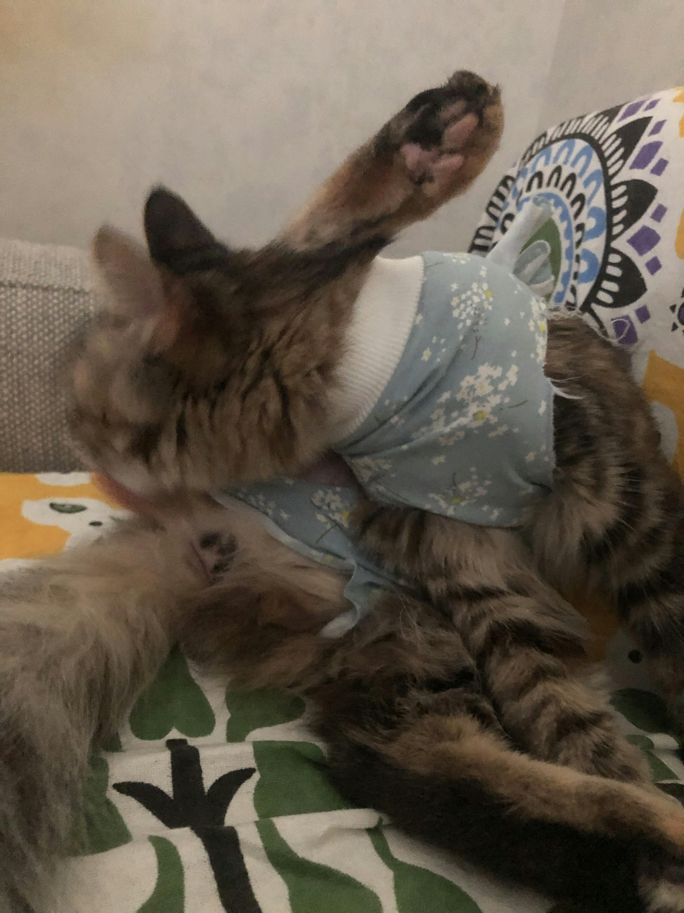

早上主动去窗台看风景、听鸟叫声。

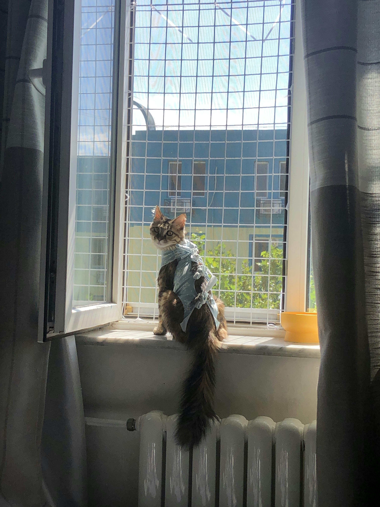

术后第四天，这张背影真好看！

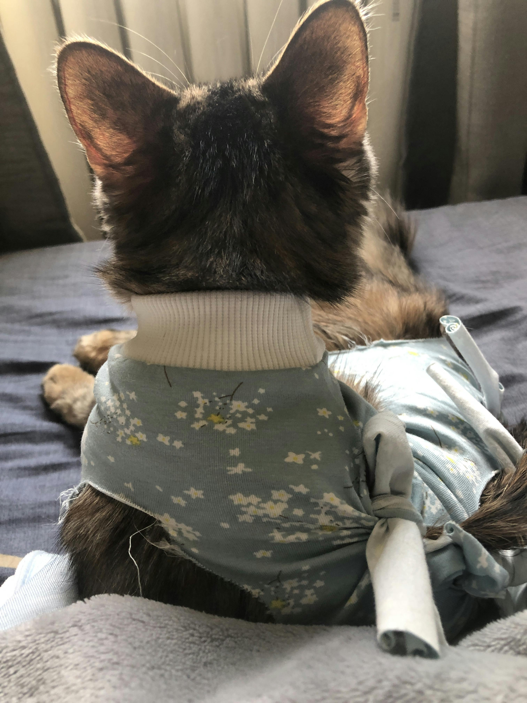

同时，也开始捣乱了。

不让铲屎官工作，即使电脑支起来也被踩上去压倒了。

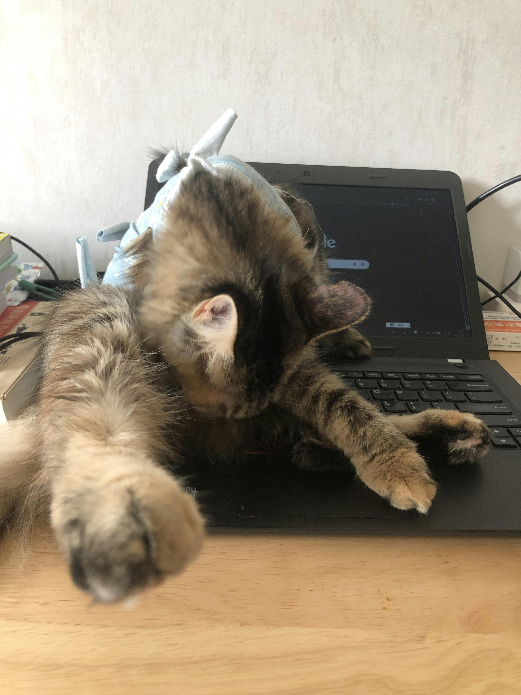

跳上零食柜好奇铲屎官的零食。

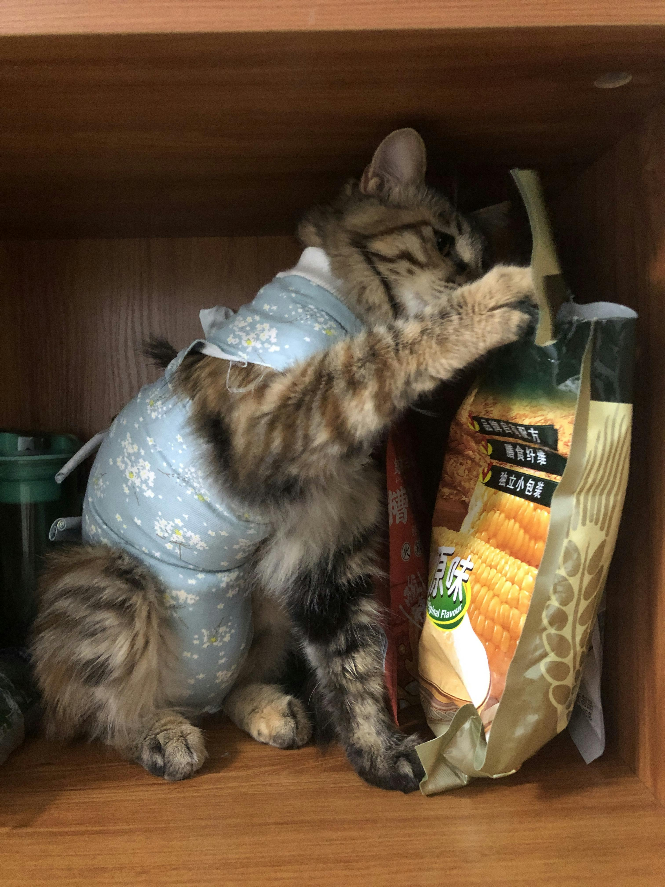

###  肠胃 & 口腔问题

术后大概第 4 天的时候，发现蹦哒拉臭是一滩稀的便便💩 铲屎官查了一下，应该是麻药对蹦哒的肠胃刺激，导致菌群变化。铲屎官以前买的益生菌没有辅料调节口味，蹦哒不喜欢，只能强行喂一点点。于是，又花钱买了点新的、适口性好的益生菌，拌在干粮里愿意吃。

两天后，蹦哒的便便💩恢复正常的条状了。

一波刚平又起一浪🌊 铲屎官发现蹦哒下唇外的皮毛有点溃烂，怀疑是舔毛咬衣服的线，线头经常挂在牙齿上，线头勒伤了嘴唇。周日去拆线、脱绝育服的时候，让医生看了一下，没有太大问题，再观察观察。

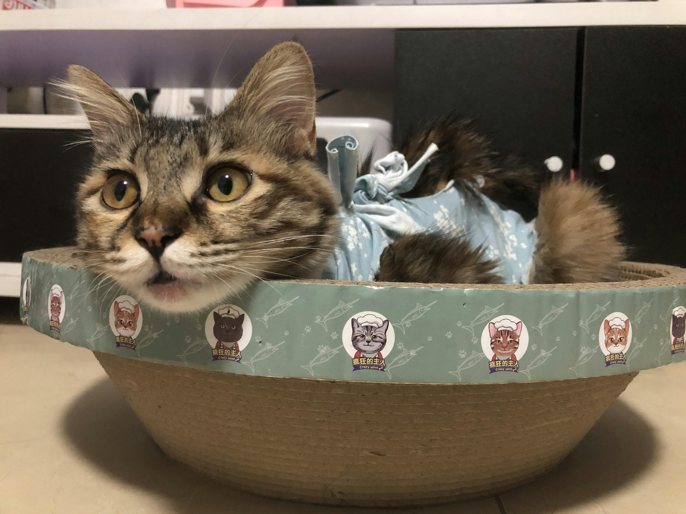

### 去拆线脱衣服

周日早带蹦哒去医院拆伤口的缝合线、脱绝育服。

可能因为去做手术时也是待在猫包里、乘自行车的，这次，蹦哒害怕、不愿意进猫包。好不容易装进了猫包，蹦哒就喵喵喵叫了一路。从进猫包开始，铲屎官就给蹦哒说话：这次是去拆线、脱衣服，不是做手术，没有骗你。

直到在医院真的拆了线、脱了衣服，蹦哒才不再害怕，知道铲屎官没有骗牠，回家的路上也没有喵喵叫，回到家依旧巡视一圈环境确认熟悉和安全。

好啦～蹦哒仍然是一只活蹦乱跳的、粘人的可爱喵🐱

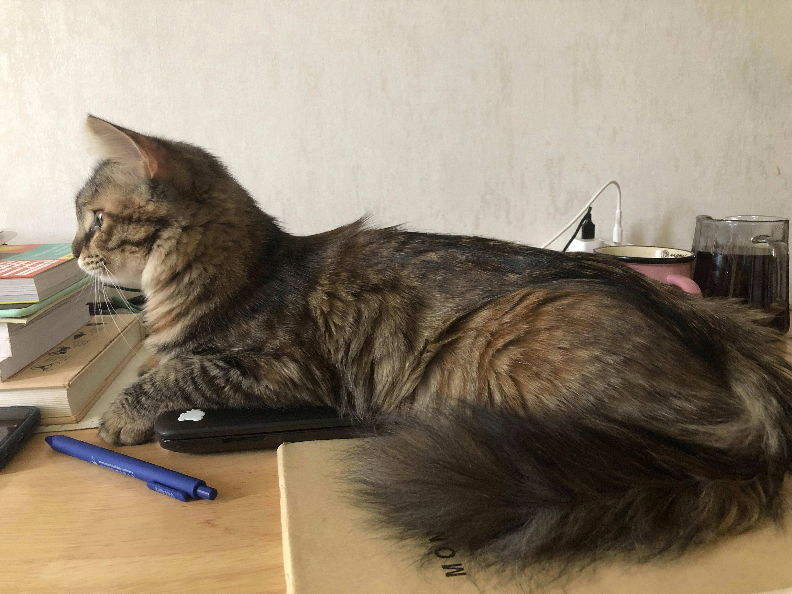

###  性格变化

铲屎官发现，蹦哒在手术之后，性格多了一点点懂事。铲屎官在吃饭的时候，不再跳上桌好奇捣乱了；自己吃完饭、洗脸，然后就去太空舱里或者猫抓板里舔猫休息。

当然，蹦蹦跳跳、粘人依旧。
