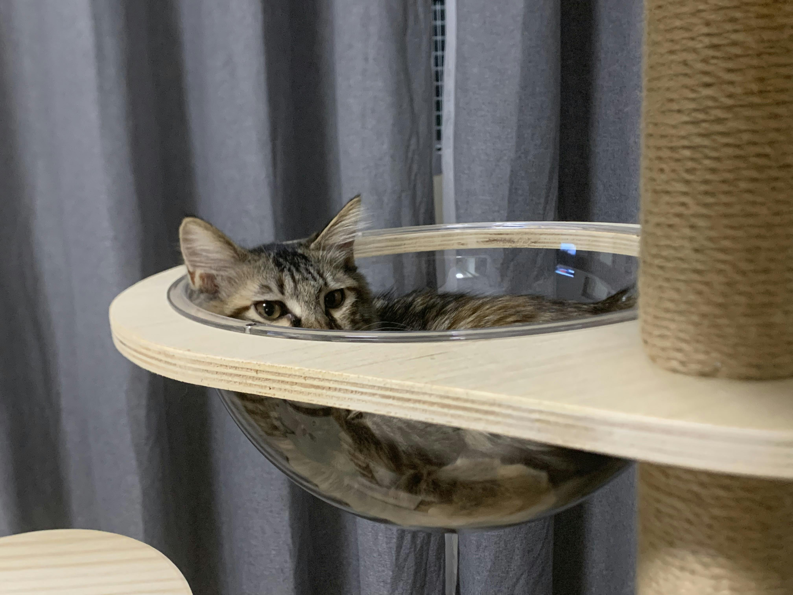
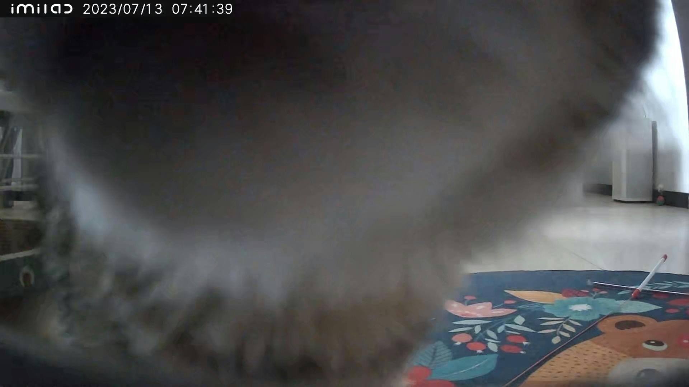
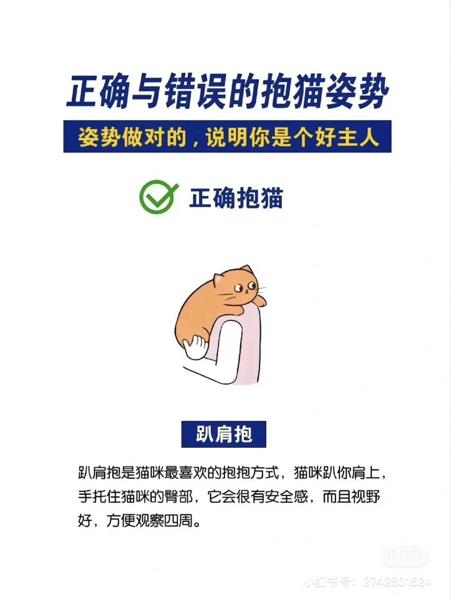
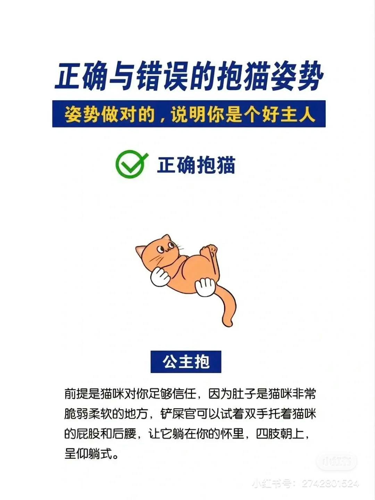
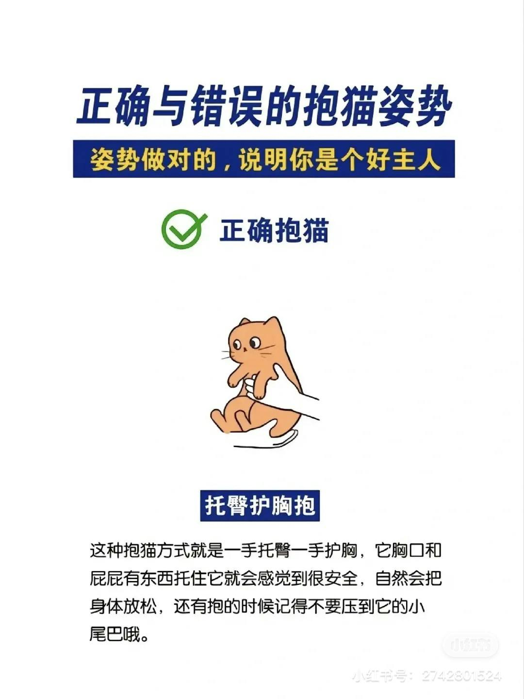

昨晚梦里的事有猫，先记录在草稿箱。梦的梗概是这样的：

跟随一伙人（隐约中有初中老师、同学、现在同事）到某地游玩，不凑巧遇到恶劣天气，只好暂时在房间呆着，可是吃的喝的都不多了。直到有一天，「蹦哒」的干粮罐头也没有了，牠饿地一直叫，躺在床上用仅有的力气呼吸、叫着。开始是喵喵叫，后来好像是在叫「妈咪、芭比」。天气没有转好的迹象，我很着急，怕蹦哒 吃不上东西会饿生病，一阵痛哭。

同楼层的有些房间门口放着冲好的猫奶粉，可是我不敢给蹦哒喝，对陌生人的救济不放心，也不敢主动敲门问。

后来，有同行的同事给我发消息说会托人带猫粮给我。我这才感到有了一线希望。

> 猫咪打字😄
> 
、0 片、- 坎坎坷坷坎坎坷坷坎坎坷坷坎坎坷坷坎坎坷坷坎坎坷坷坎坎坷坷坎坎坷坷 i 看，阿凄凄切切凄凄切切凄凄切切凄凄切切凄凄切切凄凄切切凄凄切切凄凄切切凄凄切切凄凄切切凄凄切切凄凄切切凄凄切切凄凄切切凄凄切切凄凄切切起飞 89 个人

## 铲屎官和猫咪的玩具

上周网购了小米家的云台摄像机，藏在路由器盒子里，工作日定时打开可以远程看到蹦哒在客厅的一系列活动：干饭、吨吨喝水、上厕所、玩耍、睡觉、趴椅子等铲屎官回家。

远程控制转动摄像头方向，当蹦哒发现摄像头在转动时，会好奇走过来凑近看看、嗅嗅，并没有伸爪胖揍😄

在使用摄像机之前，对于出门搬砖的铲屎官来说，十分好奇独自在家的蹦哒会做些什么。铲屎官上周每天通勤路上都会远程看蹦哒的活动，工作间隙摸鱼也是看监控回放视频，看蹦哒有没有吃饭、喝水、上厕所，截图保存蹦哒的活动照。

昨天在朋友圈看到一条「谁懂啊，当你有猫后，你的相册...🫣」真的是铲屎官们的相同写照。

虽然摄像机可以远程互通语音，但铲屎官还没有试过这样叫蹦哒，怕牠不适应、害怕。

蹦哒的白天作息时间基本是这样：

> 早上 6 点多跟着铲屎官一起醒，吃点饭。
>
> 7 点多把铲屎官送出门，会去卧室的窗台晒太阳睡觉。
>
> 10 点多会出来吃饭、喝水、上厕所、洗脸。
>
> 偶尔可能听到了鸟叫声，去阳台看看；或是在客厅玩逗猫棒、糖果。
>
> 然后又回卧室睡觉。
>
> 下午 2 点多再出来吃饭、上厕所、洗脸，回去继续睡觉。
>
> 下午 4 点多会趴在客厅的椅子上休息，等铲屎官回家。
>
> 等铲屎官上楼梯快到门口的时候，蹦哒就会嗖地一下从椅子上跑到门口，迎接铲屎官，蹭蹭、喵喵叫。

凌晨 3、4 点在卧室跑酷，玩铲屎官的脏衣篓、糖果玩具、充电线、袋子。哈哈，总之就是咬发出声响。

呼呼大睡的铲屎官听不见，睡眠浅的铲屎官就容易被吵醒，把蹦哒关到卧室门外。蹦哒挠门、喵喵叫，尝试过依然进不了卧室就安静了。等铲屎官开门就溜进来了，蹭蹭铲屎官（你以为是在认错），再过一会又开始玩耍发出声音了。

蹦哒现在习惯在猫爬架上的太空舱里睡觉了。起初把未完成的猫爬架放在餐桌旁边靠墙，空间很局促，蹦哒不喜欢上去玩耍。安装完成后挪到宽敞一点的位置，蹦哒渐渐习惯上去了。

##  铲屎官学习

铲屎官习惯从蹦哒的前腿嘎吱窝架起来。看了别人分享的经验帖，知道了抱猫咪的正确姿势。（小红书经验帖：[http://xhslink.com/fyBvjs](http://xhslink.com/fyBvjs%EF%BC%8C%E5%A4%8D%E5%88%B6%E6%9C%AC%E6%9D%A1%E4%BF%A1%E6%81%AF%EF%BC%8C%E6%89%93%E5%BC%80%E3%80%90%E5%B0%8F%E7%BA%A2%E4%B9%A6%E3%80%91App%E6%9F%A5%E7%9C%8B%E7%B2%BE%E5%BD%A9%E5%86%85%E5%AE%B9%EF%BC%81)）

铲屎官还参考其他经验帖，给蹦哒剪指甲脱敏。握爪、压爪、指甲刀碰爪、剪指甲，每一步只要蹦哒配合做，就奖励一小块冻干。果然，很顺利地剪完指甲。

前天晚上吃完饭，休息看电视的时候，把旁边的蹦哒抱到腿上，用手给蹦哒梳毛，从额头、下巴开始，再到背毛、两侧、腿，然后是肚皮，一整套 massage 按摩。蹦哒可舒服了，肚皮和腿都愿意伸展开。
