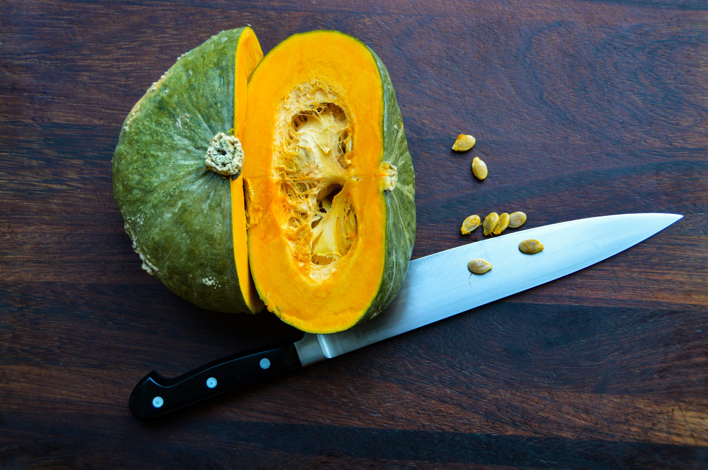
上周网购了 6 个贝贝南瓜，从三宝那里知道这个好吃的，以前孤陋寡闻，只知道普通的大南瓜。随箱里有 3 种吃法的简单说明：整蒸、南瓜布丁、煮粥 / 汤 / 炒。就是想试试不同的方法。

整蒸看似简单，我在早餐蒸的时候第一次时间不够，切开发现还是硬的，只好回锅继续蒸，直到筷子插进去是软的。吃的时候只吃了瓜肉，瓜皮扔掉了。今天第二次蒸才知道瓜皮也能吃。

今天趁周末买来烘焙纸杯，用空气炸锅试试做蛋挞和派，包括做蛋挞皮、倒入牛奶鸡蛋汁、入锅烤 3 个步骤。

下厨房的教程：

南瓜蛋挞：[https://www.xiachufang.com/recipe/106496879/](https://www.xiachufang.com/recipe/106496879/)

南瓜派：[https://www.xiachufang.com/recipe/106102790/](https://www.xiachufang.com/recipe/106102790/)

在写这篇记录时，检索查到最初被冠以[贝贝南瓜](https://zhuanlan.zhihu.com/p/421024233)之名的是来自日本的少爷（坊ちゃん）南瓜，在日语中，南瓜被称为 “かぼちゃ（kabocha）”，读起来就感觉很呆萌，它的词源来自柬埔寨瓜（カンボジア瓜），南瓜是日本民众在战时的主要粮食，[现在主要有 3 个品种：日本系南瓜、西洋系南瓜、pepo 系南瓜](https://mp.weixin.qq.com/s?__biz=MzIzNzExMDcwNQ==&mid=2247485753&idx=1&sn=2587b79f2ebc8ad48a93b1c21de12141&chksm=e8ccdde7dfbb54f1643fd01d4284a6e25c7e34503909d5a87f788ec517e4df78a9b71fcd5737&scene=21#wechat_redirect)。

南瓜到达日本的时间是 1541 年，随着葡萄牙船漂到了如今日本的大分县。相传当时的战国武将**大友宗麟**引进了南瓜的种植，自此开启了日本南瓜的历史，因此在《织田信奈的野望》中大家会发现大友宗麟全身都是南瓜元素。

如今日本栽培的南瓜品种大体分为三个大家族，他们分别是日本系南瓜、西洋系南瓜以及 pepo 系南瓜。

南瓜，原产自墨西哥到中美洲一带，明代传入中国。我们常说的 “南瓜” 在物种上其实应包括原产于美洲的三兄弟 “南瓜”、“笋瓜” 和“西葫芦”，它们同属葫芦科南瓜属（Cucurbita）。南瓜三兄弟在英语中被统称为 “squash”，会用“pumpkin” 来特指形状扁圆，颜色一般为橙黄色的南瓜。

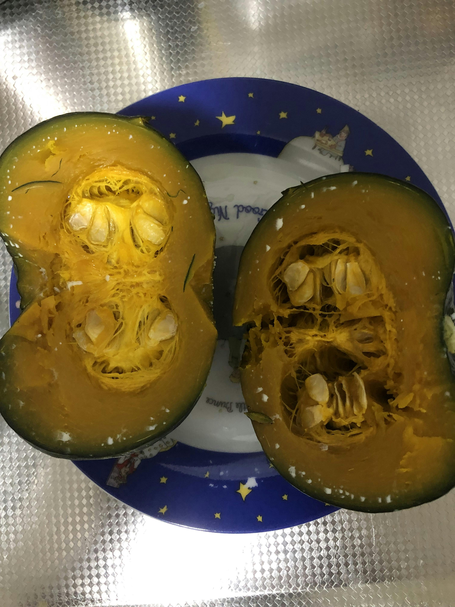

南瓜出现白色斑点，表示这个瓜的淀粉含量高。

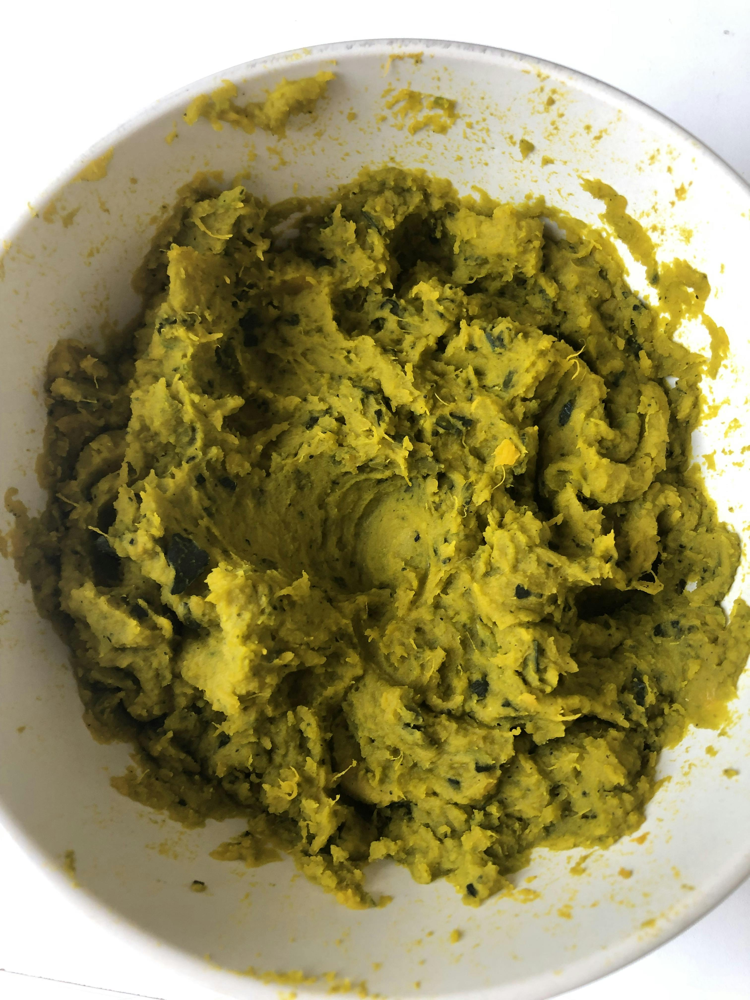

把瓜肉和瓜皮捣成泥状，这个需要力气。就像揉面一样，越成泥越要用大力。

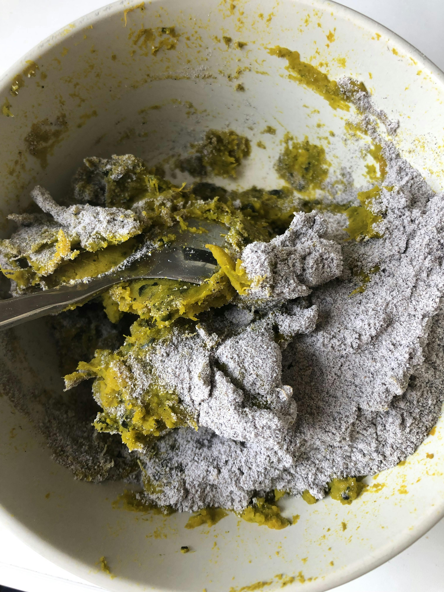

教程上用的普通白面粉，我改加黑米面，稍微有点多，最后涂在比较薄的烘焙纸杯上作为蛋挞皮，不够高、不够厚，所以中间的鸡蛋牛奶汁不多，烤出来膨胀不足。

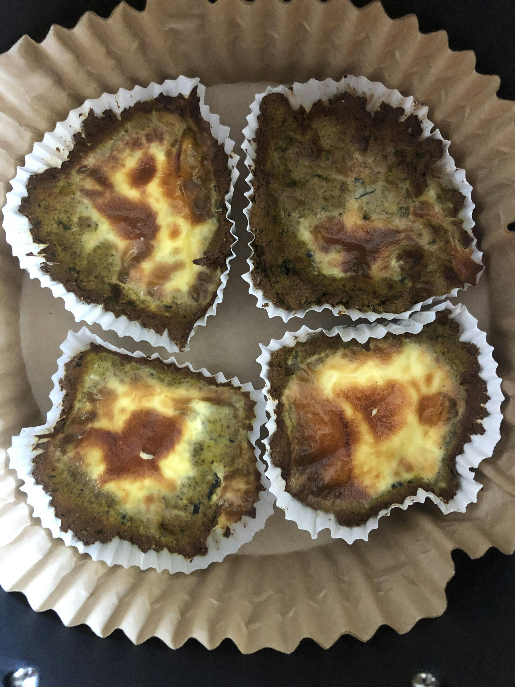

南瓜蛋挞和南瓜派的材料同时准备。南瓜派有 3 层：香蕉、燕麦、牛奶泥做派底，南瓜、牛奶、鸡蛋泥做中层、酸奶做上层点缀。

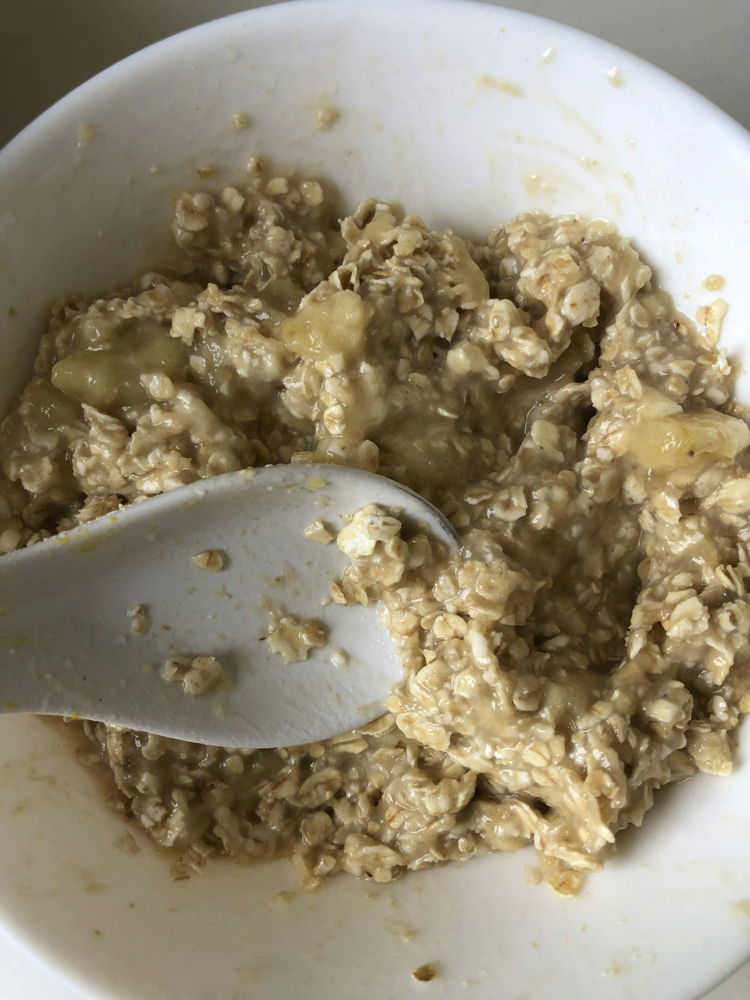

香蕉、燕麦、生椰牛奶泥

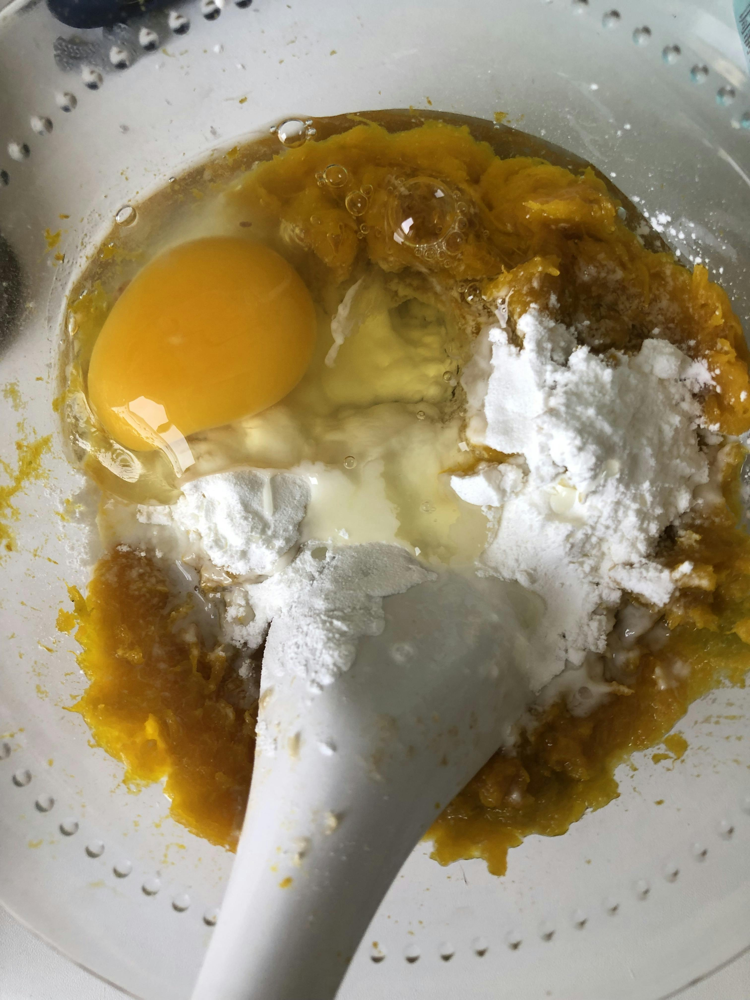

南瓜、鸡蛋、牛奶成泥。没有打米糊机器，就手动用力搅拌。

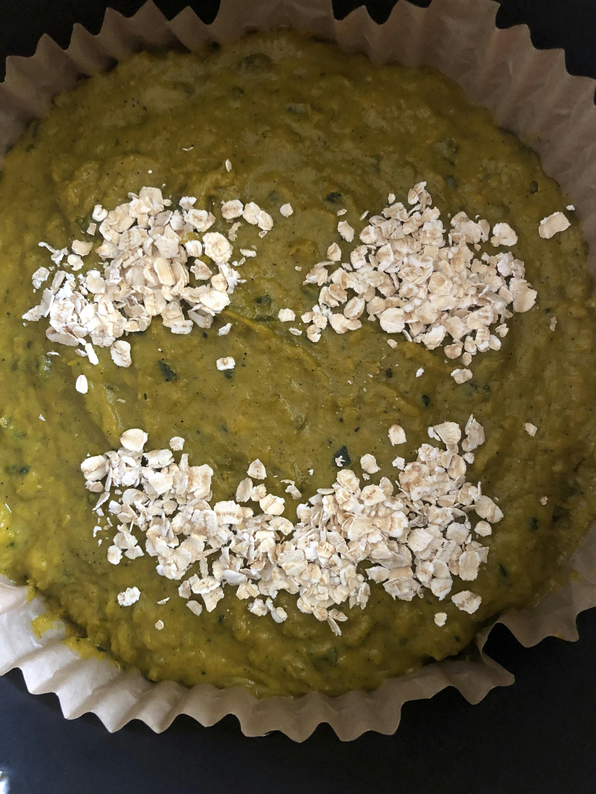

灵机一动，烤前用燕麦撒出笑脸样子。

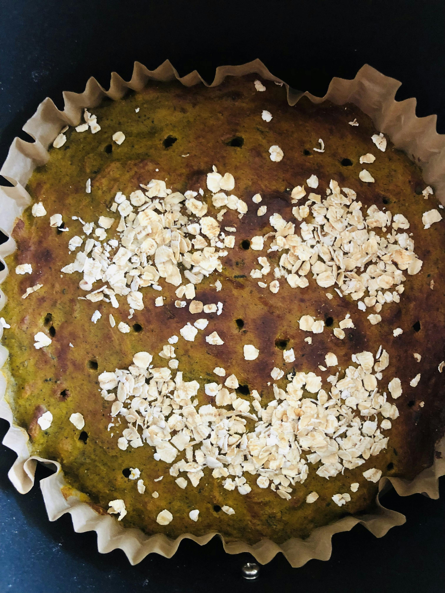

先烤了 20 分钟，用筷子戳了很多洞，继续烤 15 分钟。

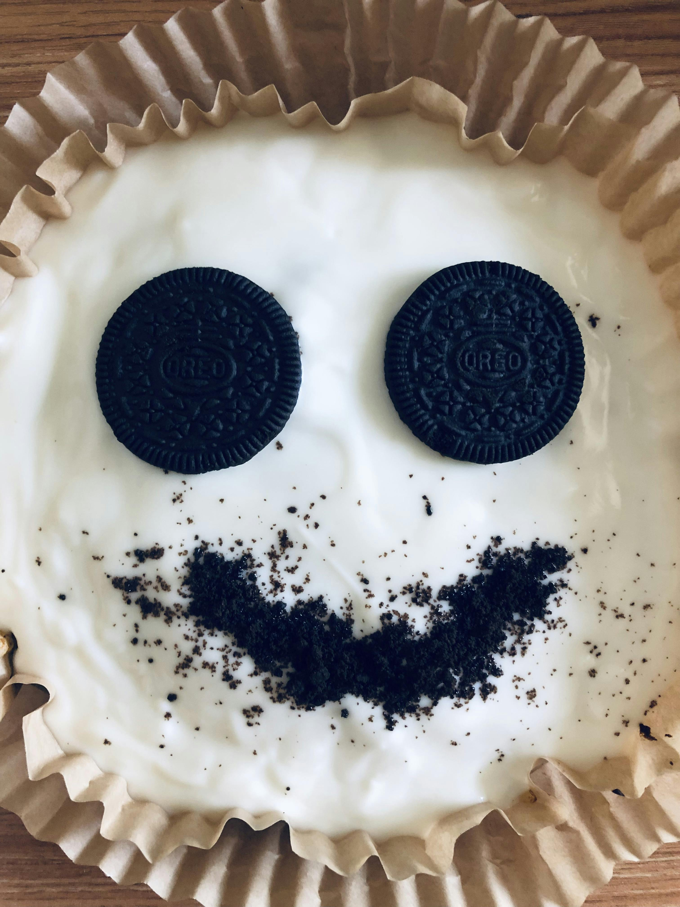

烤好出锅铺满酸奶，但是太白了，就用奥利奥饼干点缀。

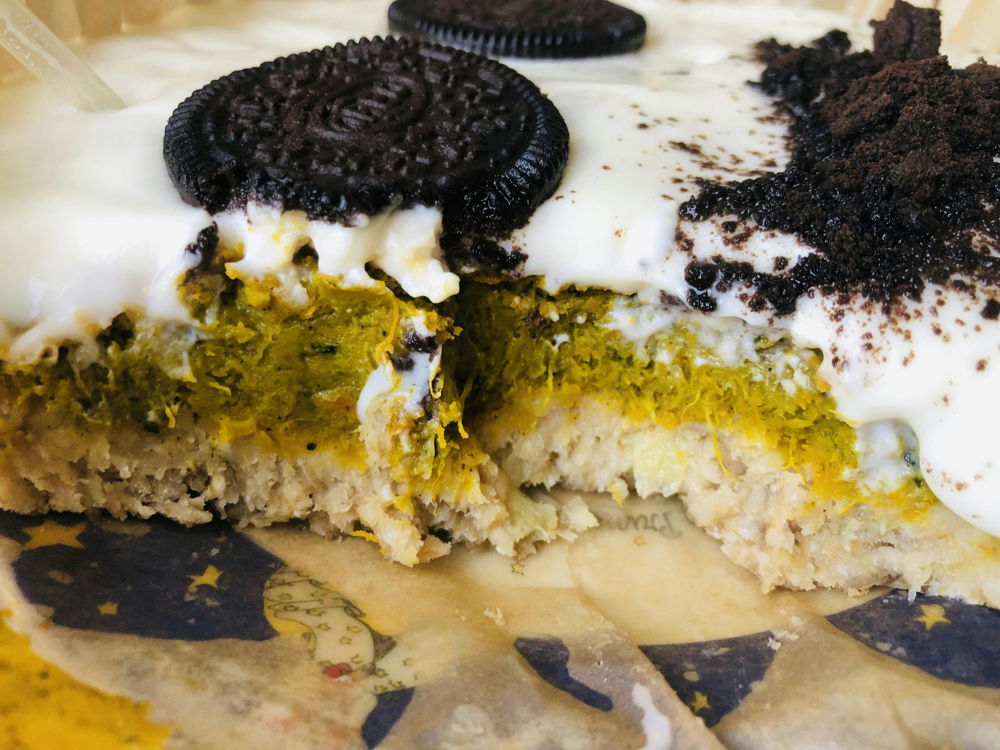

开始吃南瓜派，货真价实的 3 层，临近晚饭时间吃了三分之一，剩下的冷藏，第二天早餐吃完了。

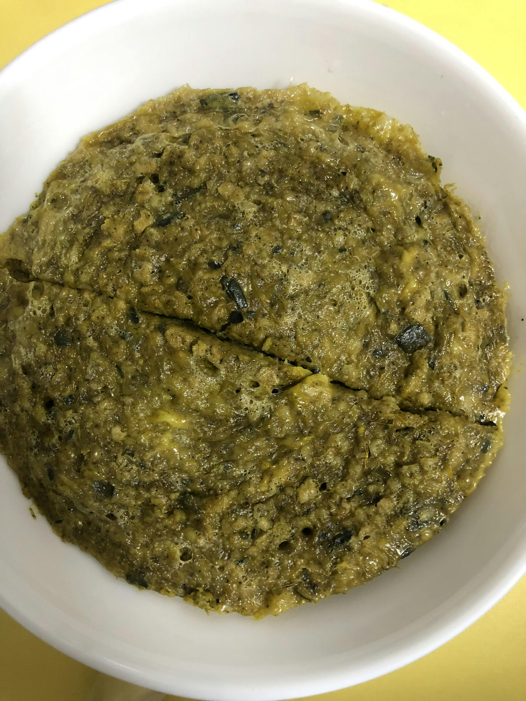

多余的一碗南瓜鸡蛋牛奶泥，试着用微波炉烤，微微蓬松。

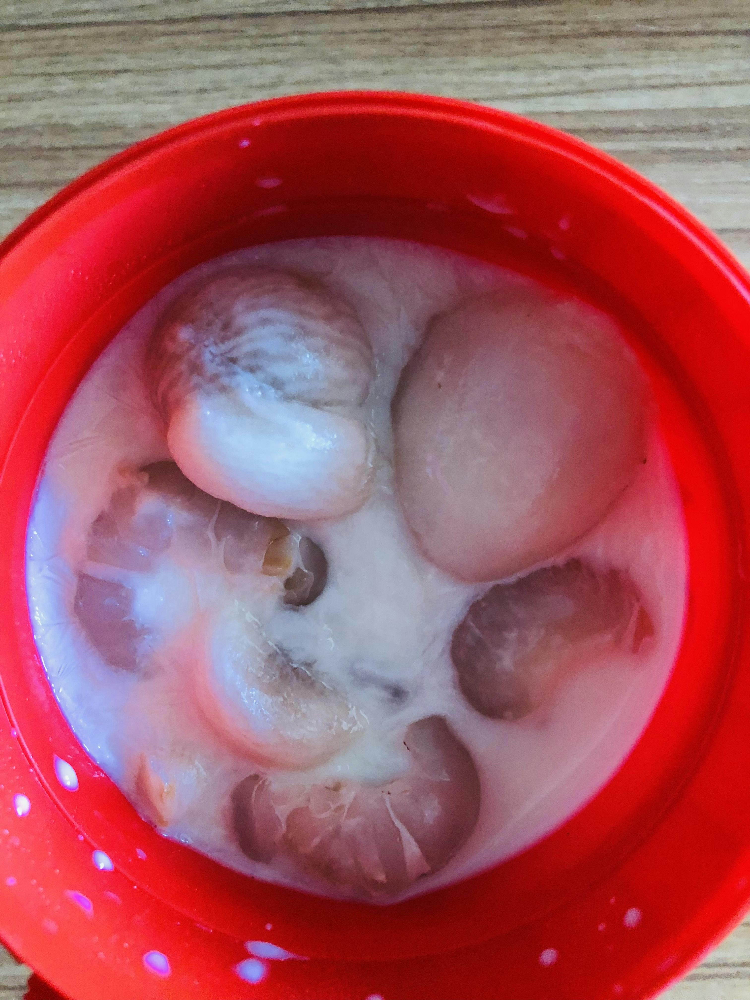

昨天特别热，早上用吃完的冰淇淋杯子冻荔枝和山竹。第一次知道荔枝还能这样吃，可能很多水果都可以用牛奶泡着冻。
