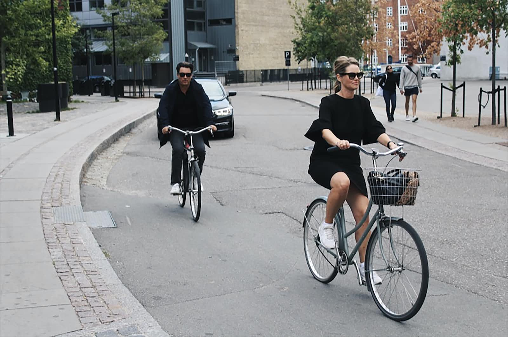

童年时期学会骑自行车，这恐怕是大多数人在孩子阶段的一项重要运动技能。然而，我在小时候，莫名其妙地没有学骑自行车。直到 2023 年中段，我在内外因素的推动下，终于花时间学习骑自行车。

现在回想起这事，会把「错过童年乐趣」的责任推卸给父母。这种说辞只为在他人面前为自己辩解，显然不是全貌、深刻地解释。说的次数多了，自己也开始好奇小时候不学骑自行车的原因。

最近因为处理家里的琐事，「原生家庭」「出身」这些词时常浮现，先撇开这些抽象的词意，从具体的小事开始看——我小时候怎么没学骑自行车？

仔细想来，从学前班到小学再到初中，从家到学校一直很近，步行不足 5 分钟就能到达，上学用不到额外的交通工具。上了高中则彻底住在学校。在无需骑车就去学校这件事上，我没有选择的余地。

跟着爷爷奶奶去庄稼地里，要么走路，要么坐在双轮架子车上。即使去镇子上的市集，走路、坐架子车、搭顺风汽车、由大人骑自行车载着。不曾想过自己学骑自行车，这样会更方便，爷爷奶奶、父母也没有安排我学。

现在想来，「学骑自行车」就像一层窗户纸，隔在我和家人之间，好像都在等待对方何时戳破这层纸说出来。而我处在一个保护层里，体会不到丰富多样的生活和玩耍。

在家教严格的环境里，我缺失了一部分调皮捣蛋，跟同学在河边、街镇游玩的乐趣。记得隔壁是修理汽车的一户人家，他家的孩子跟我同龄，经常在外面跑着玩，每次来叫我出去玩的时候，就被父母找理由推辞了。

不知从何时起，我不对家人表达自己的想法，哪怕是看到别人家的小孩在吃什么零食，自己想要的时候，并不会直截了当地给家人说「我也想要......」，而是脸部表情变得有点不开心，眼神直勾勾地看向别人手里的零食，等待大人发现我的神态，试探性地问我的时候，我才会点头示意或者低声说出来。

从小被保护地很好，习惯了被动投喂，很温顺，没有经历过严厉的批评。再长大一些，跟着父母一起生活，环境风格发生变化，做事总要小心翼翼，思前想后是否恰当。记得小学五六年级时，眼睛出现近视，上课看不清黑板上的字，老师叫我回家去配一副眼镜。当时，我不敢直接给父母说这件事，觉得近视是我的不对、会被说平时看电视太久、距离太近，总之，预设出自己可能面对的批评。所以，我在某天早晨出门上学前，在茶几上留了张纸条，用写字的方式表达了需要配眼镜。

小时候没有学骑自行车，等到上了大学，父母、亲戚多次建议我去考汽车驾照。可惜，我这时有明确的自我主见——对汽车不感兴趣、尾气污染大、容易交通拥堵——不想考驾照学开车。所以，直到现在，我也没有学开汽车。

现在，我之所以决心学骑自行车，主要是考虑为出行便捷。以前，每次跟同事去单位附近稍微远的地方吃饭，总是担心他们要骑车过去，实际上是走路去的，这样路上还能聊天。租房子也尽量找距离地铁近的位置，但随之而来的就是租金偏高。

不会骑自行车限制了自己的生活范围。所以，在最近的一次挪窝找房时，就和队友商量、下决心要学骑自行车，这样放大了新窝的可选项。在安顿好之后，趁着天气尚好，晚上在小区门外的小道学骑，事先买了护膝、护腕、护肘的装备，队友指导、示范、陪练。中途因为天气、下班晚等原因，零零星星暂停过。经过一段时间的练习，终于，我学会了比较稳定地骑自行车，转弯、灵活躲闪迎面来的逆行车、灵活调整车速。

虽姗姗来迟，我找回了童年缺失的骑车技能和乐趣。
