7月15日23点多，同事紧急召唤我，询问能否在17日前往昆明替补投标，19日返回。我看了看日历有空档，就跟同事商量买票。

第二天准备出差的行装，在小红书搜索昆明半日/一日游玩推荐帖，结合住宿位置，挑选了几个打卡点，默默加入收藏夹。在准备衣服的时候，特意拿了长袖外套，以防下雨、早晚气温低冷。

第三天从早到晚是在动车上度过的。一路向西，穿过一拱又一拱山洞，进入云南境内，云层越来越厚，眼看就要与山尖相碰；车厢的滚动信息显示，室外温度降到了25度左右。到站走出车厢，亲身感受到了凉爽、舒适。

哇，单从气温看，这里是理想的避暑胜地。

我和已经到站的同事打车去酒店，找路熟悉次日下午办事的地方。

第二天早餐过后，我花点时间处理了临时工作——其实晚上或者第二天处理也可以。大约10点半，我急匆匆地出门。

囧途从这里开始。

出门查路线，扫了一辆共享电动车，我这才想起来忘记带耳机，只好把手机地图导航声音调到最大，手机放在篮子的帆布袋里。就这样看导航走走停停，40分钟后到了滇池的绿道外，可惜禁止共享车进入——地图导航可能也不知道这个规定。只好走进步行。

先在栈道上向北散步，由近到远地看绿油油的湖水。

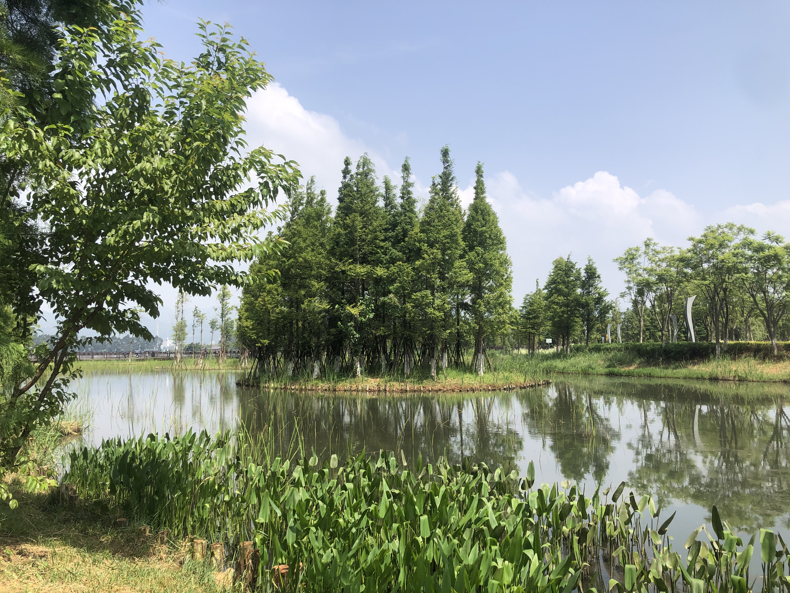

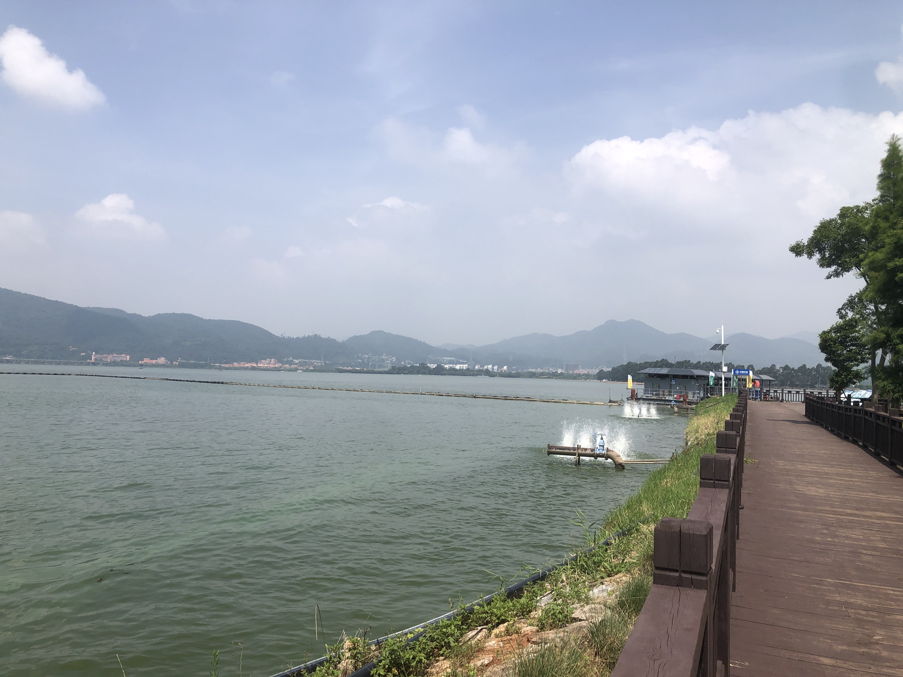

原计划沿着绿道走到滇池北边，从地图上看过于遥远，就改道反方向去滇池观景码头。为了缩短时间，我扫了一辆共享山地自行车——收费9元/30分钟，伴着「咔咔咔」声响，10分钟到达码头。自己锁车失败，呼叫客服解决，以至于叫我帮忙拍照的游客后来没找我。

此刻，已经11点多了，太阳正当直。码头上，从西边吹来的湖风，很凉快，以至于我忘记了自己正在烈日之下光着胳膊行走。

就这样，我在码头上走荡了1个多时，从东到西，从西到东。

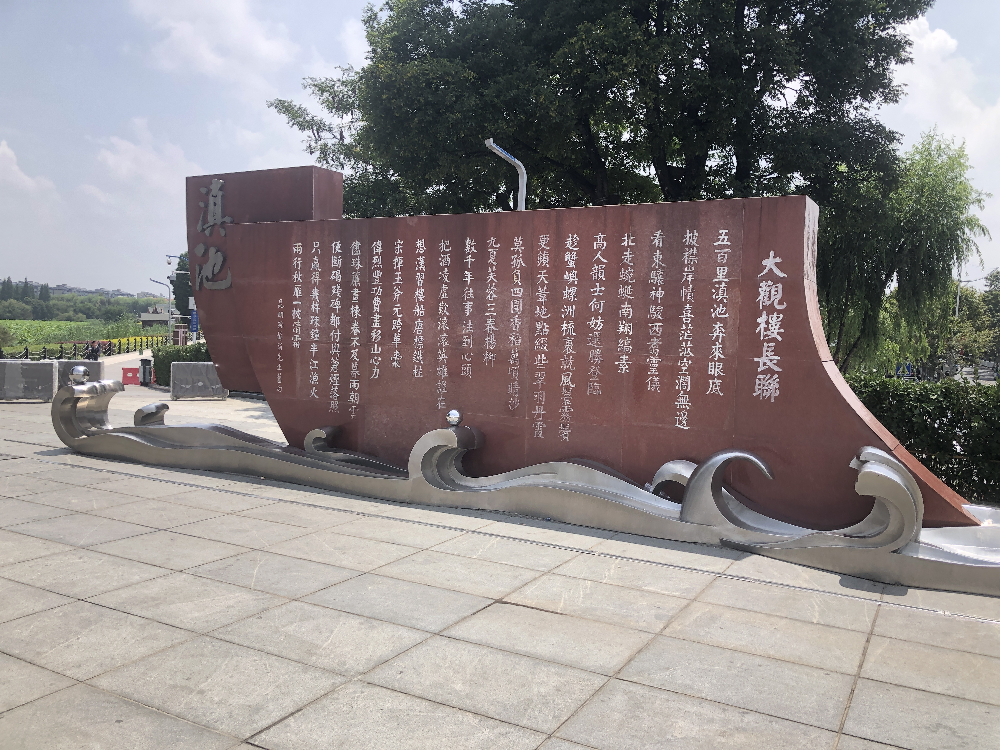

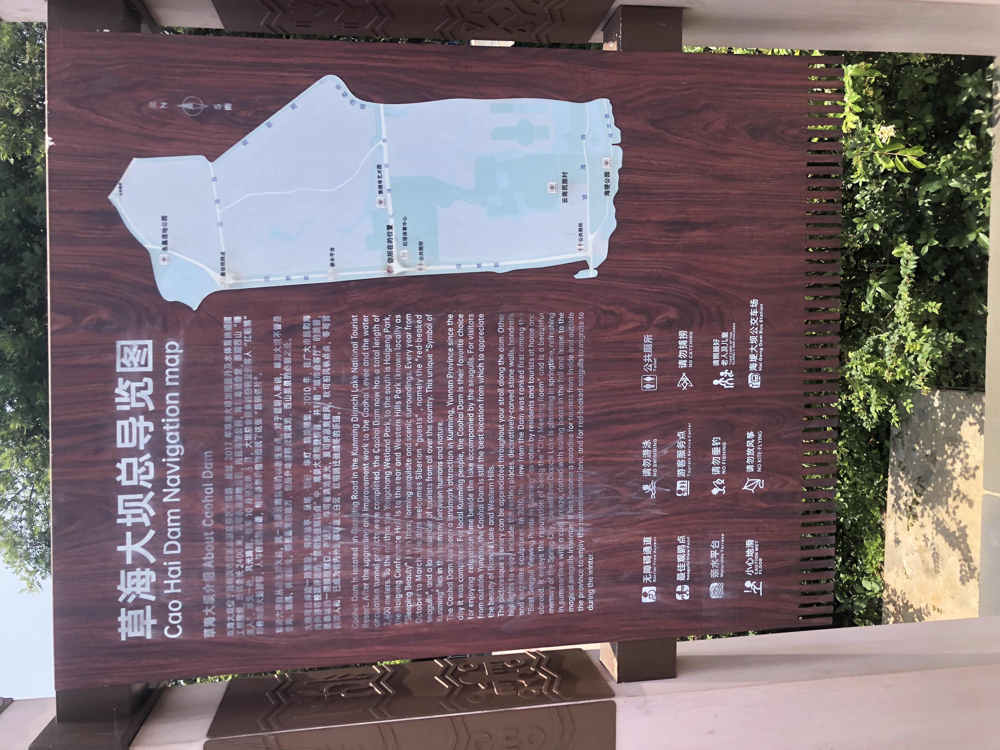

滇池依山傍云，给红嘴鸥提供栖息地、给游客提供观光价值和生存途径——专业的付费拍照、便捷的贩售机、拍照周边、观光索道、直播。

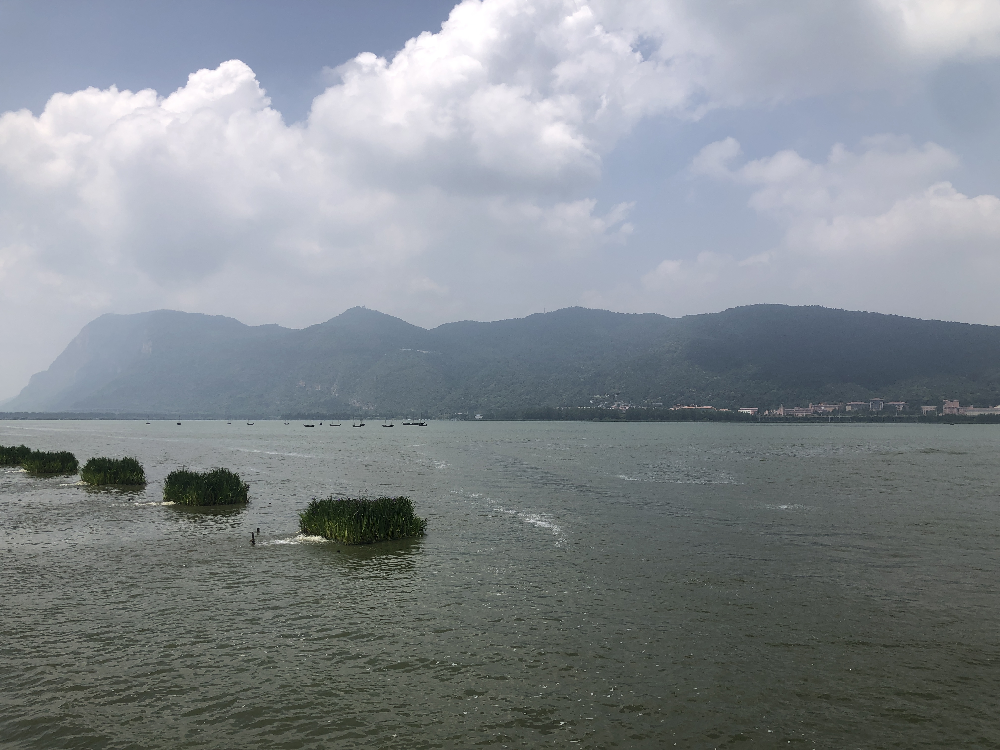

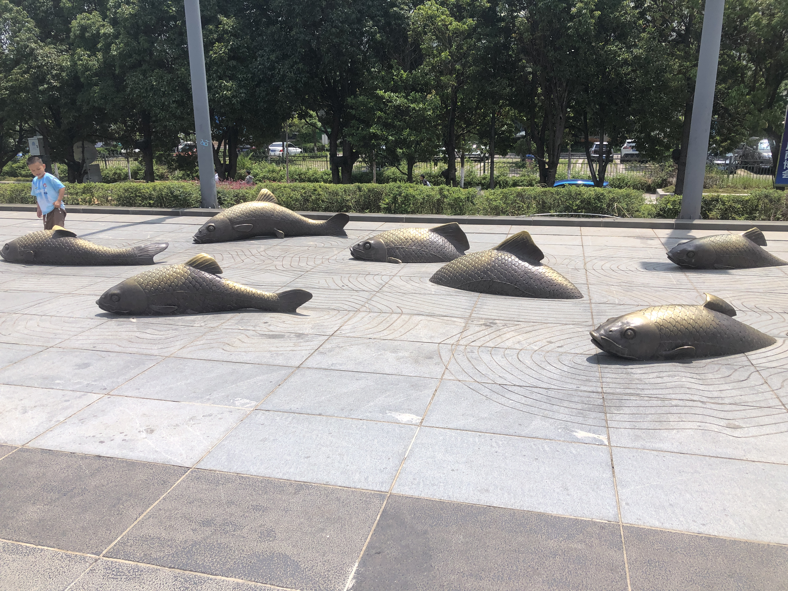

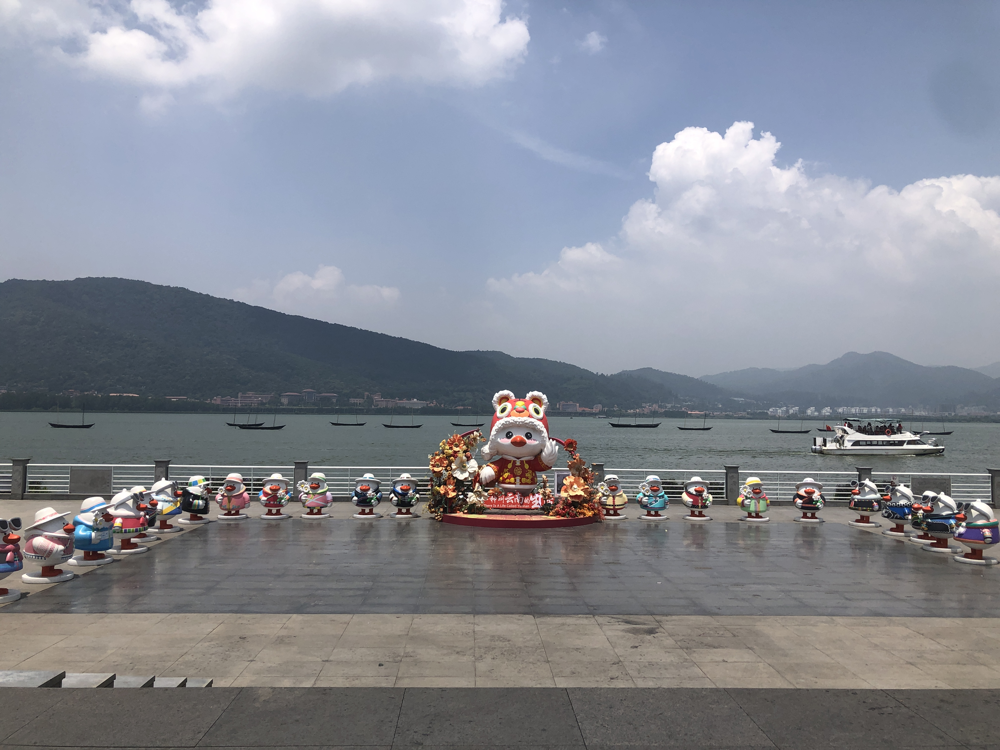

12点半左右，我从码头启程骑车返回酒店。在半路经过一个小桥，我骑上坡时变换车轨，结果在台阶处摔倒了，电车甩了出去，幸亏没有撞到来往的机动车。我自己双膝双手触地，左手掌和左膝盖各有一块皮擦破见红，裤子磨破一条缝。

我起身扶起电车，看着左手掌破皮、还有一丝粘连，坚持骑车回到酒店。

从酒店前台借了碘伏棉棒、创可贴、棉球棒。同事帮我给伤口清理消毒、贴创可贴。我看着鲜红的伤口，越来越痛，以至于身体突然虚脱头晕，同事急忙扶我坐下来，从前台拿来一些白糖给我吃。头冒虚汗之后，我感觉才恢复过来。

下午办完事，我发现从胳膊到手背，皮肤变红，摸着很烫——早上在码头晒伤了。

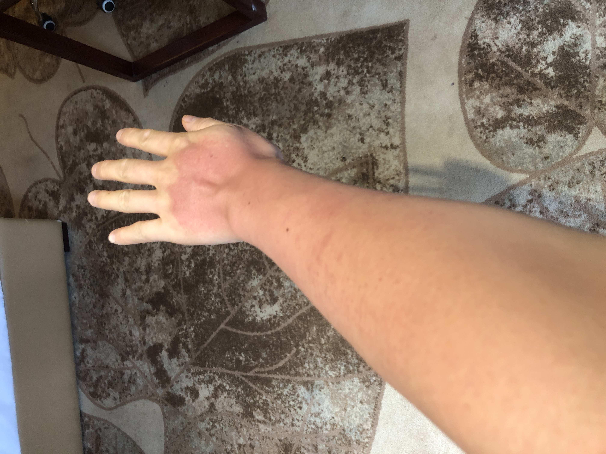

下午，我穿了长袖外套，和同事骑车去滇池，逛完北边的大观楼，继续骑车去码头，溜达到天黑。

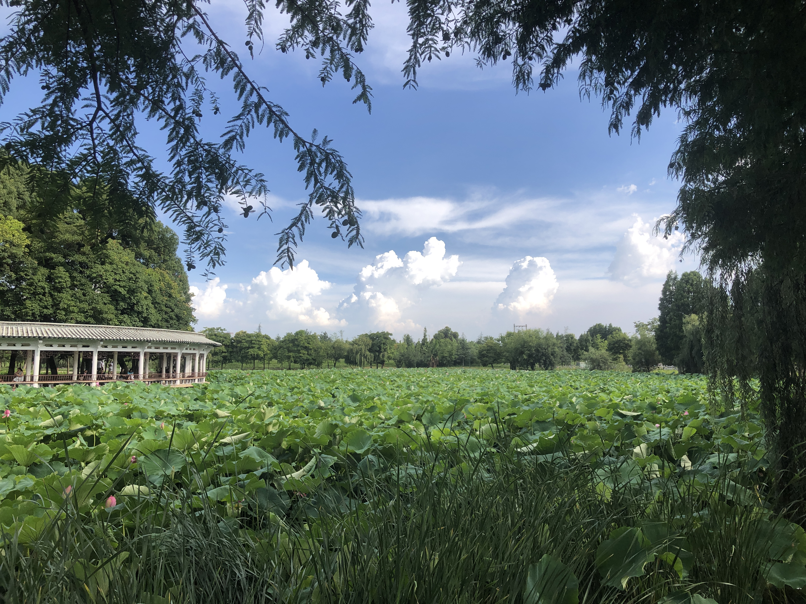

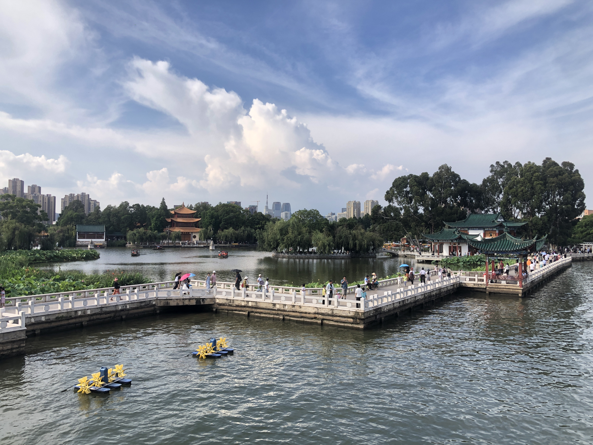

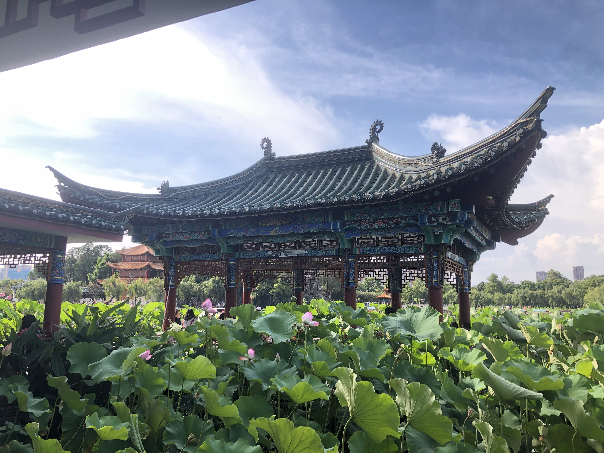

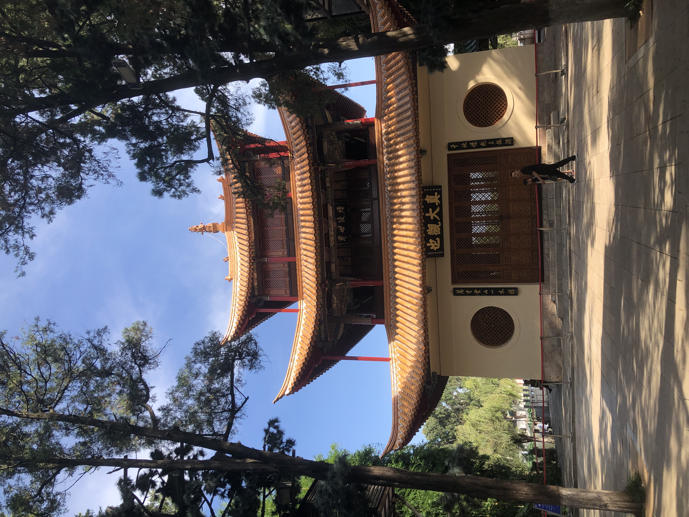

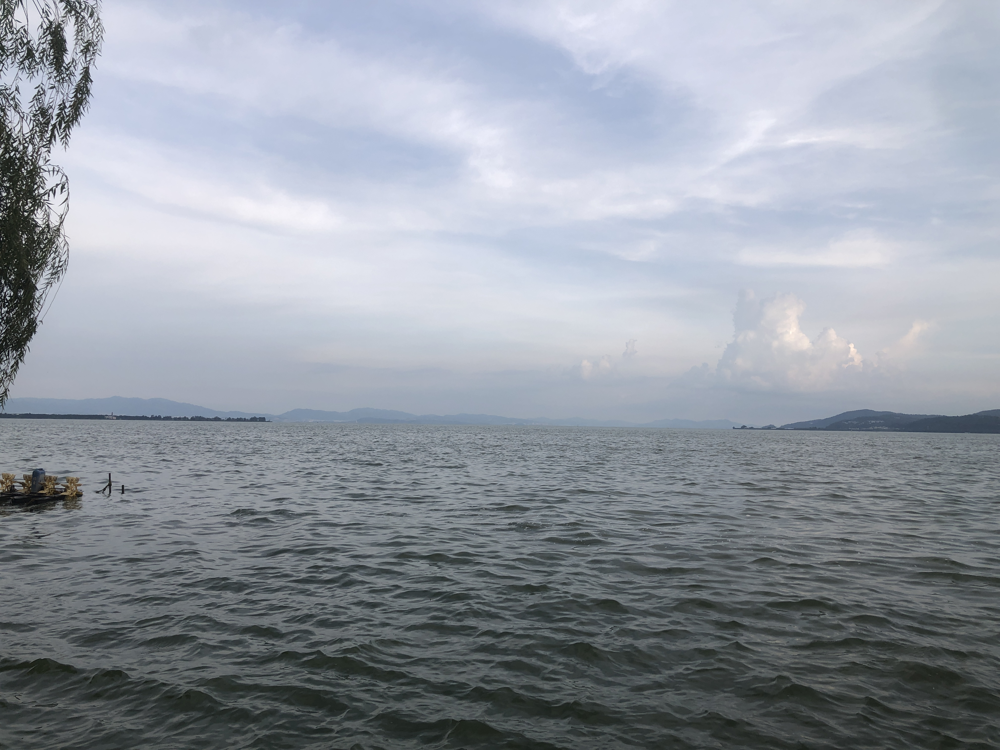

晚上回到酒店，我从外卖平台买了碘伏、创可贴、纱布、棉球，同事帮我给伤口换了新的棉球、创可贴。

第二天早上继续换新，在膝盖伤口缠纱布固定。收拾好行李，我带着擦伤和晒伤这两个 buff，和同事去逛昆明最贵的农贸市场——篆新市场，在店铺档口之间穿梭，看看稀奇的菌菇、水果，买小红书帖子推荐的小吃食。

接着，我们去昆明老街快速地逛街、拍照。中午分道扬镳去车站、机场。

我晚上回到家，队友开始给我的胳膊敷硼酸溶液、擦芦荟胶，持续了5、6天，晒伤的皮肤终于好转，温度恢复常温，红色变成黑色，开始一点点蜕皮。伤口每日涂碘伏、暴露在空气中透气，也逐渐结痂，恢复到自己可以洗头、洗澡的状态。

嗯，这就是我的昆明囧行。

