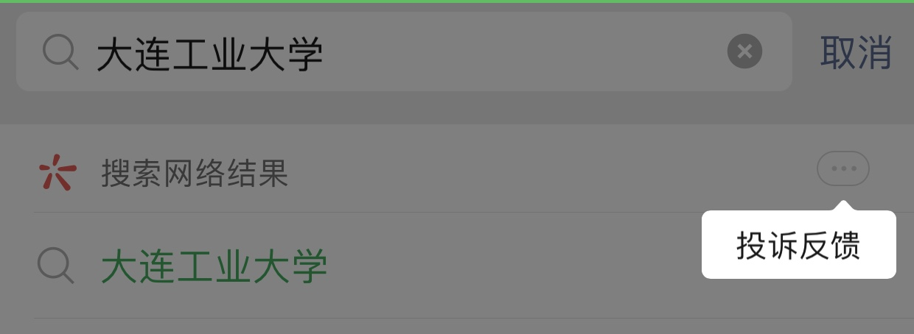
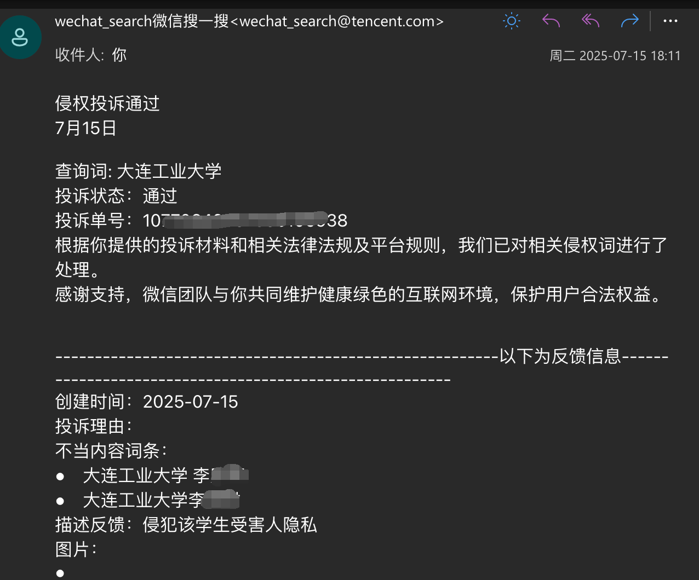
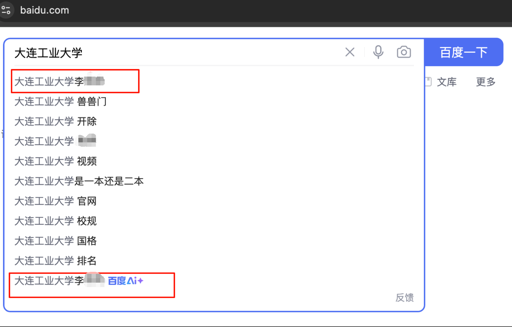
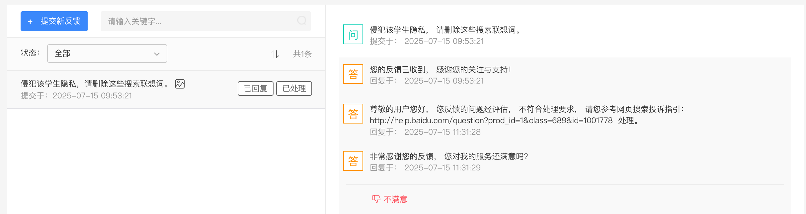
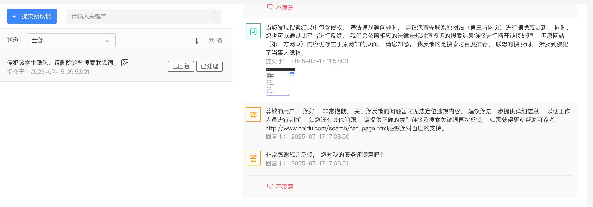

大连工业大学对一位学生的开除学籍处分通告，在互联网上引发了评论和[媒体报道](https://theinitium.com/zh-hans/article/20250718-whatsnew-mainland-dalian-university-expel-female-student-hurt-national-dignity)。

如果把媒体、社交平台看作一个笼罩，那么，它们的不妥当做法对受害人来说毫无保护之力，反而是打开了数不清的瞄准口。

无意间，我在微信的搜索框（搜一搜）输入「大连工业大学」时，显示了一系列推荐/联想的搜索词，有的推荐词就显示出了这份通告的当事女生的姓名。

我注意到搜索框右上角有一个不起眼的「投诉反馈」按钮，便尝试向微信反馈这个侵权问题。

当天收到了微信的处理结果反馈，然后，我再在微信里搜索时没有显示这件事的受害人的姓名。

接着，我好奇百度搜索对此会是怎样的。当我在百度的搜索框中输入部分词后，给我推荐了一系列搜索词。

然后，我在右下角的反馈里填写了推荐搜索词可能侵权的问题，百度很快给了答复。

> 尊敬的用户您好， 您反馈的问题经评估， 不符合处理要求， 请您参考网页搜索投诉指引： http://help.baidu.com/question?prod_id=1&class=689&id=1001778  处理。

这个结果，我当然不满意，查看了提供的指引链接内容，并没有找到对应的说法。我就继续回复反馈：

> “当您发现搜索结果中包含侵权、 违法违规等问题时， 建议您首先联系原网站（第三方网页）进行删除或更新。 同时， 您也可以通过此平台进行反馈， 我们会依照相应的法律法规对您投诉的搜索结果链接进行断开链接处理， 但原网站（第三方网页）内容仍存在于原网站的页面， 请您知悉。 ”
> 我反馈的是搜索时百度推荐、 联想的搜索词， 涉及到侵犯了当事人隐私。

百度继续给了下面的答复：

> 尊敬的用户， 您好， 非常抱歉， 关于您反馈的问题暂时无法定位违规内容， 建议您进一步提供详细信息， 以便工作人员进行判断， 如您还有其他问题， 请提供正确的索引链接及搜索关键词再次反馈， 如需获得更多帮助可参考： http://www.baidu.com/search/faq_page.html 感谢您对百度的支持。

这样的回复真敷衍，读不懂中文和图片内容，还是并不认为这些推荐搜索词有什么不妥？不得而知。